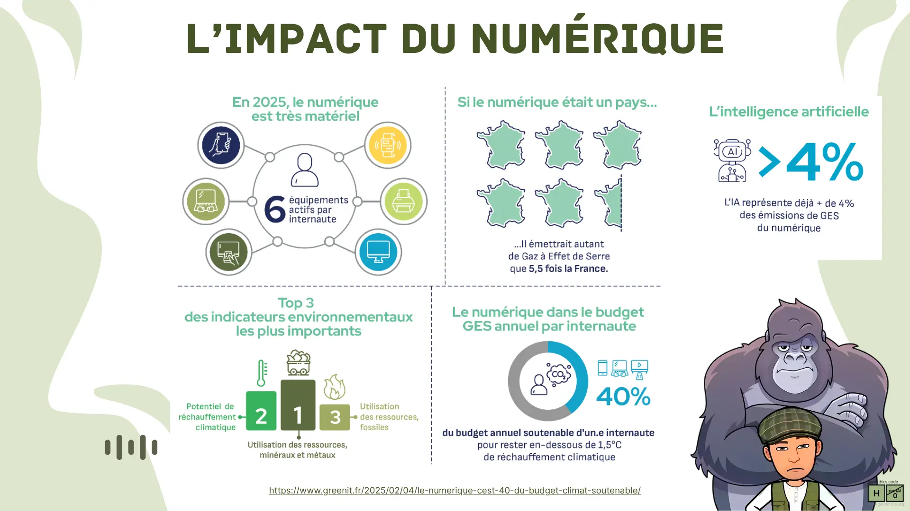
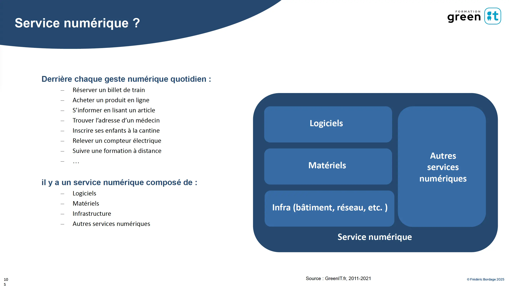
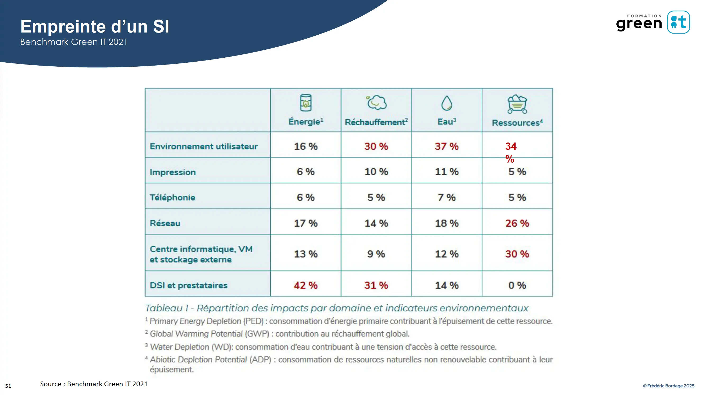
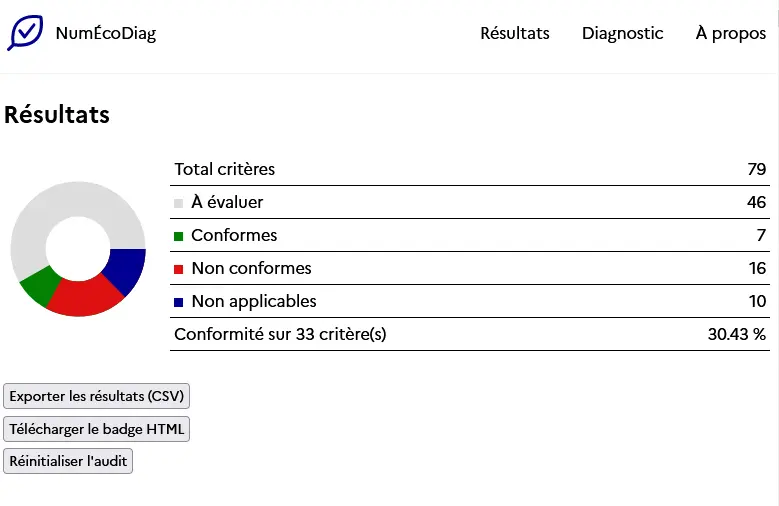
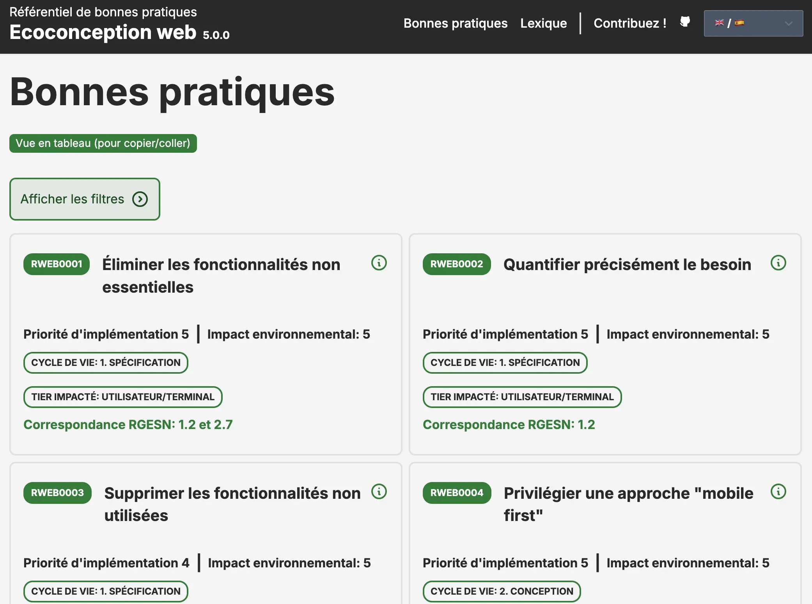
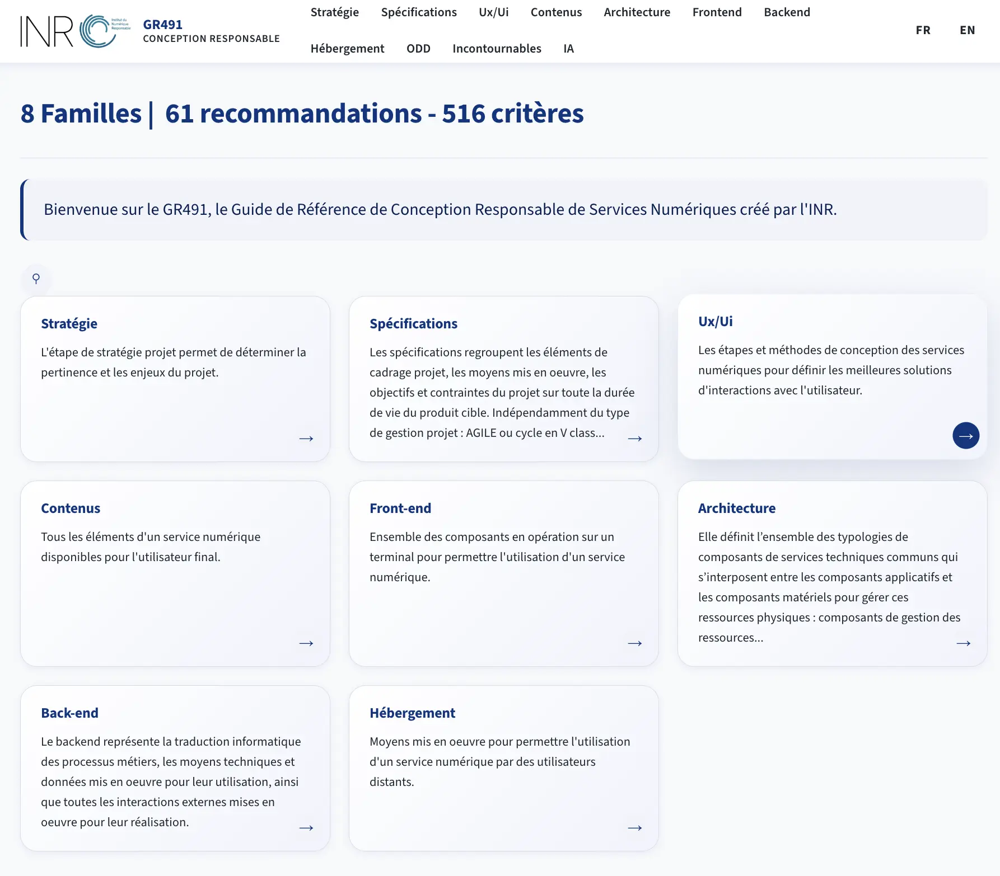
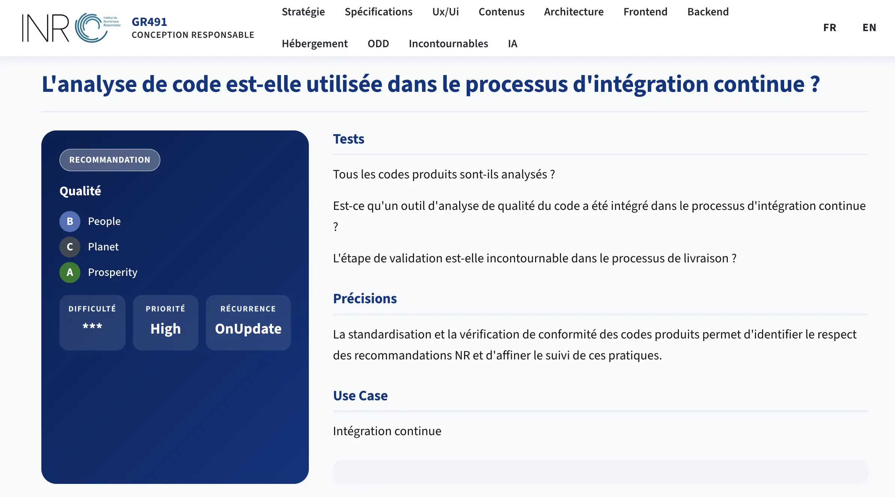

# Les référentiels

> Sondage à main levée :
> **Dans un service numérique, qui consomme le plus ?**
>
> - A) Votre téléphone ou ordinateur
> - B) Le réseau (câbles, antennes, routeurs)
> - C) Les serveurs et datacenters

---

## Rappel : l'impact du numérique


Le numérique représente aujourd'hui :

- **4 %** des émissions mondiales de gaz à effet de serre - et ce chiffre augmente de **+8 % par an**¹
- **10 %** de la consommation mondiale d'électricité²
- En France : **2,5 %** des émissions nationales, soit ~17 Mt CO2e/an³
- **34 milliards** d'équipements numériques en France pour 68 millions d'habitants³

---

## Les 3 tiers du numérique

Tout service numérique s'appuie sur 3 tiers :

```
┌──────────────────┬──────────────────┬──────────────────┐
│    TERMINAL      │     RÉSEAU       │   DATACENTER     │
│ (votre appareil) │ (câbles, relais) │  (les serveurs)  │
├──────────────────┼──────────────────┼──────────────────┤
│    60 – 80 %     │    15 – 20 %     │     5 – 15 %     │
│  de l'impact     │  de l'impact     │  de l'impact     │
└──────────────────┴──────────────────┴──────────────────┘
```



La surprise : c'est **votre téléphone**, pas les datacenters, qui pèse le plus.

Ce n'est pas uniquement la fabrication, c'est l'**usage**. 
Un service lourd force le terminal à calculer plus, à chauffer davantage, à vider la batterie plus vite. L'utilisateur rachète un appareil plus tôt.

> 80 % de l'impact des terminaux vient de leur **fabrication**, pas de leur usage.

> Prolonger leur durée de vie est le levier #1, bien avant d'éteindre les datacenters.

Source : [Luccioni et al. (2024) - Power Hungry Processing](https://arxiv.org/abs/2311.16863)

### L'empreinte d'un SI (Système d'Information)


---

## Les référentiels

### RGESN - Référentiel Général d'Écoconception de Services Numériques


Le [RGESN](https://ecoresponsable.numerique.gouv.fr/publications/referentiel-general-ecoconception/) est le référentiel de l'État pour l'écoconception des services numériques.

Il couvre **79 critères** répartis en 9 familles :

| Famille        | Exemples de critères                                          |
|----------------|---------------------------------------------------------------|
| Stratégie      | Politique d'écoconception documentée, référent désigné        |
| Spécifications | Fonctionnalités réduites au strict nécessaire                 |
| Architecture   | Mutualisation des ressources, pas de serveur dédié inutile    |
| UX/UI          | Pas d'autoplay vidéo, animations réduites, dark mode          |
| Contenus       | Images compressées, formats adaptés, pas de vidéo par défaut  |
| Frontend       | Minification, lazy loading, pas de framework inutile          |
| Backend        | Requêtes optimisées, pas de données inutiles transférées      |
| Hébergement    | Énergie renouvelable, PUE bas, localisation des données       |
| Algorithmie    | Frugalité de l'entraînement et de l'inférence des modèles IA  |

### RGAA - Référentiel Général d'Amélioration de l'Accessibilité

Le [RGAA](https://accessibilite.numerique.gouv.fr/) définit les critères pour rendre les services numériques accessibles à tous (handicap visuel, moteur, cognitif...).

> Accessibilité et écoconception sont complémentaires : un service léger et bien structuré est souvent plus accessible.

Le lien est structurel :
- HTML sémantique → meilleure accessibilité **et** poids réduit
- Images optimisées → texte alternatif (accessibilité) **et** performance
- Pas d'autoplay → personnes épileptiques (accessibilité) **et** sobriété

### NumÉcoDiag


[NumÉcoDiag](https://ecoresponsable.numerique.gouv.fr/ressources/documents-reference/referentiel-general-ecoconception/numecodiag/) est l'outil de la DINUM pour évaluer la maturité d'une organisation sur le numérique responsable.

> Vous pouvez l'installer sous forme d'extension afin de le tester durant le cours.
> Il vous aidera à prendre en main le référentiel.

---

## L'écosystème des référentiels

Le RGESN n'est pas seul. Selon une étude GreenIT.fr (2025) auprès de 157 professionnels, **62 % utilisent au moins un référentiel** et les combinent :

| Référentiel                                                                                                                             | Éditeur            | Utilisation |
|-----------------------------------------------------------------------------------------------------------------------------------------|--------------------|-------------|
| [RWEB](https://rweb.greenit.fr/fr/fiches) - Référentiel d'écoconception web                                                             | GreenIT.fr         | **72 %**    |
| [RGESN](https://ecoresponsable.numerique.gouv.fr/publications/referentiel-general-ecoconception/) - Référentiel Général d'Écoconception | État français      | **64 %**    |
| [Guide écoconception](https://eco-conception.designersethiques.org/guide/) - Designers Éthiques                                         | Designers Éthiques | **31 %**    |
| [Autres référentiels Green-IT](https://www.greenit.fr/ressources-et-chiffres_cles/#h-referentiels)                                      | GreenIT.fr         | **17 %**    |
| Autres (RMOB, REIPRO, Greenconcept…)                                                                                                    | -                  | **10 %**    |



Les enseignements clés :

- **80 %** de ceux qui utilisent le RGESN le complètent avec le RWEB, jugé "plus opérationnel"
- **40 %** ajoutent le guide des Designers Éthiques pour mieux couvrir l'UX/UI
- **25 %** s'appuient simultanément sur ces trois référentiels

> *"Il n'existera jamais un seul et unique référentiel d'écoconception de service numérique car leur diversité est trop importante."*
> - GreenIT.fr, 2025

Source : [Quels sont les référentiels d'écoconception vraiment utilisés ? - GreenIT.fr (2025)](https://www.greenit.fr/2025/09/04/quels-sont-les-referentiels-decoconception-vraiment-utilises/)

### GR491 - Guide de Référence de Conception Responsable

Le [GR491](https://gr491.isit-europe.org/) est le référentiel de l'**Institut du Numérique Responsable (INR)**. 

Plus exhaustif que le RGESN, il couvre **516 critères** déclinés depuis **61 recommandations** sur 8 familles thématiques.

Les mêmes que le RGESN (Stratégie, Spécifications, UX/UI, Contenus, Architecture, Frontend, Backend, Hébergement), auxquelles s'ajoutent des sections sur les ODD et l'IA responsable...



> Ce que j'aime c'est la composante 3P et la praticité des fiches (ex: usage du BDD)

Exemple de fiche :
[](https://gr491.isit-europe.org/crit.php?id=4-7051-backend-la-qualite-du-logiciel-produit-a-un)

| Dimension        | RGESN              | GR491                     |
|------------------|--------------------|---------------------------|
| Éditeur          | État français      | INR (associatif)          |
| Critères         | 79                 | 516                       |
| Licence          | -                  | Ouverte v2.0 Etalab       |
| Positionnement   | Référentiel légal  | Guide transversal complet |

---

## Explorer le RGESN

En groupes de 3-4 - chaque groupe choisit **1 famille RGESN**.

**15 min d'exploration :**

1. Ouvrez le [RGESN](https://ecoresponsable.numerique.gouv.fr/publications/referentiel-general-ecoconception/)
2. Parcourez les critères de votre famille
3. Complétez ce tableau dans votre éditeur :

```markdown
| Famille choisie                 | …                      |
|---------------------------------|------------------------|
| Nombre de critères              | …                      |
| Critère le plus actionnable     | …                      |
| Critère le plus surprenant      | …                      |
| Application concrète au projet  | …                      |
```

**Restitution (3 min par groupe) :** un insight inattendu, une application concrète sur votre projet.

---

## Ce qu'on retient

Dans votre éditeur - sans chercher la "bonne" réponse :

```markdown
Avant je pensais que le levier #1 était _______________,
maintenant je sais que c'est _______________.

Le critère RGESN que je vais chercher en premier
sur mon prochain projet : _______________.
```

---

## Le cadre légal : dates clés

Les référentiels (RGESN, RGAA, GR491...) sont volontaires. Mais un corpus législatif vient progressivement les rendre obligatoires, en France et en Europe.

| Date d'application | Texte                                                                       | Ce qu'il impose                                                                                                                                               |
|--------------------|-----------------------------------------------------------------------------|---------------------------------------------------------------------------------------------------------------------------------------------------------------|
| 25 mai 2018        | RGPD - Règlement Général sur la Protection des Données                      | Encadre la collecte et le traitement des données personnelles ; premier grand texte rapprochant numérique et responsabilité.                                  |
| 1ᵉʳ janvier 2021   | Loi AGEC (anti-gaspillage pour une économie circulaire, 2020)               | Impose l'indice de réparabilité sur les smartphones, ordinateurs portables, etc. pour lutter contre l'obsolescence programmée.                                |
| 15 novembre 2021   | Loi REEN - Réduction de l'Empreinte Environnementale du Numérique           | Pose les bases légales de l'écoconception : création du RGESN et obligation pour les grandes collectivités de se doter d'une stratégie numérique responsable. |
| 17 mai 2024        | Décret d'application de la loi REEN (écoconception des services numériques) | Rend progressivement obligatoire l'écoconception des principaux services numériques de l'État, des grandes collectivités et des grandes entreprises.          |
| 17 février 2024    | DSA - Digital Services Act (règlement européen)                             | Responsabilise les plateformes numériques sur la modération des contenus, la transparence des algorithmes et la publicité ciblée.                             |
| 1ᵉʳ août 2024      | AI Act - règlement européen sur l'intelligence artificielle                 | Premier cadre juridique mondial sur l'IA ; application progressive (interdictions dès février 2025, gouvernance dès août 2025).                               |
| 1ᵉʳ janvier 2025   | Échéance "stratégie numérique responsable" (loi REEN, art. 35)              | Les collectivités et EPCI de plus de 50 000 habitants doivent avoir formalisé leur stratégie numérique responsable.                                           |
| 28 juin 2025       | European Accessibility Act (transposé en droit français)                    | Étend des obligations d'accessibilité numérique proches du RGAA à de nouveaux produits et services du secteur privé.                                          |

> Ces échéances évoluent au gré des décrets d'application : à vérifier sur [Légifrance](https://www.legifrance.gouv.fr/) avant toute utilisation en contexte professionnel.

---

## Ressources

- [RGESN - ecoresponsable.numerique.gouv.fr](https://ecoresponsable.numerique.gouv.fr/publications/referentiel-general-ecoconception/)
- [RGAA - accessibilite.numerique.gouv.fr](https://accessibilite.numerique.gouv.fr/)
- [NumÉcoDiag - DINUM](https://ecoresponsable.numerique.gouv.fr/ressources/documents-reference/referentiel-general-ecoconception/numecodiag/)
- ¹ [The Shift Project - Lean ICT : Pour une sobriété numérique (2019)](https://theshiftproject.org/article/pour-une-sobriete-numerique-rapport-shift/)
- ² [IEA - Electricity 2024](https://www.iea.org/reports/electricity-2024)
- ³ [ADEME/Arcep - Évaluation de l'empreinte environnementale du numérique en France (2023)](https://www.arcep.fr/uploads/tx_gspublication/etude-empreinte-environnementale-numerique-2023_mars2023.pdf)
- [Quels sont les référentiels d'écoconception vraiment utilisés ? - GreenIT.fr (2025)](https://www.greenit.fr/2025/09/04/quels-sont-les-referentiels-decoconception-vraiment-utilises/)
