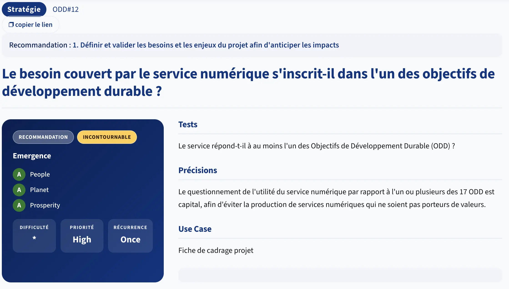

# Stratégie

> Parle de *pourquoi et pour qui* avant de parler de *comment*.

## Introduction
Letter-flop est open source sur GitHub. Son API est documentée avec Swagger. 

Elle utilise PostgreSQL, Spring Boot et TypeScript -> des technologies standards sans lock-in propriétaire.

> *Avant de regarder les critères : est-ce que ça veut dire que la famille Stratégie est bien couverte sur ce projet ?*

---

## Les 10 critères

Ils s'organisent en trois groupes selon leur nature.

### Groupe A - Avant de coder : utilité et cibles (1.1 – 1.2)

**1.1 - Le service a-t-il été évalué favorablement en termes d'utilité en tenant compte de ses impacts environnementaux ?**

Avant de construire, a-t-on posé la question : *ce service doit-il exister ?*
Un outil interne qui double un outil existant, une feature consultée par 2 % des utilisateurs, une app mobile qui fait la même chose qu'une PWA.

Ce critère force l'arbitrage *build vs. no build* avant que la moindre ligne de code soit écrite.

**1.2 - Le service a-t-il défini ses cibles utilisatrices, les besoins métiers et les attentes réelles des utilisateurs-cibles ?**

La sobriété commence par ne pas construire l'inutile.

Des `personas` flous produisent des features floues qui produisent du code inutile qui consomme des ressources inutiles.

---

### Groupe B - L'organisation : référent, revues, objectifs (1.3 – 1.5)

**1.3 - Le service a-t-il au moins un référent identifié en écoconception numérique ?**

Une personne nommée, avec une mission explicite. Pas "tout le monde est responsable" (formule qui signifie *personne ne l'est*). 

Ce référent porte les arbitrages quand la sobriété entre en conflit avec le time-to-market.

**1.4 - Le service réalise-t-il régulièrement des revues pour s'assurer du respect de sa démarche d'écoconception ?**

Un audit ponctuel produit un rapport. Des revues régulières produisent une culture. 

Ce critère demande une cadence :
- trimestrielle
- par sprint
- à chaque release

et des traces de cette cadence.

**1.5 - Le service s'est-il fixé des objectifs en matière de réduction ou de limitation de ses propres impacts environnementaux ?**

Des objectifs chiffrés et datés : 
- EcoIndex ≥ B d'ici Q3 
- image Docker < 200 MB 
- aucun endpoint > 500 ms au 95e percentile 

Sans cible, tout progrès est anecdotique.

---

### Groupe C - Les choix responsables (1.6 – 1.10)

**1.6 - Le service collecte-t-il la donnée de façon responsable et raisonnée ?**

Deux dimensions : les *données utilisateurs* (minimisation, finalité, durée de conservation) et les *données techniques* (ne pas stocker ni transférer ce qu'on n'utilise pas). 

> Un `SELECT *` est aussi un problème de collecte irresponsable.

**1.7 - Le service a-t-il recours à un niveau de chiffrement adapté à ses besoins ?**

"Adapté" signifie ni trop, ni trop peu :
- `HTTPS` sur les communications exposées
- chiffrement des données sensibles au repos
- sans sur-engineering cryptographique pour des données publiques

C'est un critère d'hygiène de sécurité autant qu'éco.

**1.8 - Le service a-t-il mis en place des efforts d'open source ?**

Publier le code, les configurations, les outils de mesure. L'open source réduit la duplication : si votre outil interne est open, d'autres équipes n'ont pas à le reconstruire. C'est aussi un levier de transparence sur les pratiques.

**1.9 - Le service a-t-il été conçu avec des technologies standard interopérables plutôt que des technologies spécifiques et fermées ?**

- `SQL` ouvert vs. base propriétaire
- `REST/JSON` vs. protocole maison

Le lock-in technique génère de la dette et de la dépendance à un éditeur dont le cycle de vie peut forcer des migrations coûteuses.

**1.10 - Le service repose-t-il sur des API documentées et ouvertes pour interagir avec le matériel ?**

- Pour les services web : les APIs exposées sont-elles documentées et accessibles sans barrière ? 
- Pour les services embarqués ou IoT : les drivers et protocoles d'accès au matériel sont-ils ouverts ? 

Ce critère vise l'évitabilité du vendor lock-in au niveau du matériel et des interfaces.

---

## Stratégie de Letterflop

En binôme - 10 minutes.

Ouvrez le dépôt : 

| #    | Critère (résumé)                     | ✓ / ✗ / Partiel | Preuve ou absence |
|------|--------------------------------------|-----------------|-------------------|
| 1.1  | Utilité évaluée (impacts env.)       |                 |                   |
| 1.2  | Cibles et besoins définis            |                 |                   |
| 1.3  | Référent écoconception identifié     |                 |                   |
| 1.4  | Revues régulières                    |                 |                   |
| 1.5  | Objectifs de réduction fixés         |                 |                   |
| 1.6  | Données collectées raisonnablement   |                 |                   |
| 1.7  | Chiffrement adapté                   |                 |                   |
| 1.8  | Efforts open source                  |                 |                   |
| 1.9  | Technologies standard interopérables |                 |                   |
| 1.10 | API documentées et ouvertes          |                 |                   |

**Indices pour les critères moins évidents :**
- *1.6* - Quels champs stocke `MovieLog` ? Sont-ils tous affichés dans la liste historique ?
- *1.7* - Regardez `docker-compose.yml` (ports exposés) et `application.properties`. L'appel vers TMDB, lui, est-il chiffré ?
- *1.10* - Cherchez `OpenApiConfig.java` et l'URL `/swagger-ui.html` dans le README.

<details>
<summary>Correction</summary>

| #    | Critère                               | Résultat | Justification                                                                 |
|------|---------------------------------------|----------|-------------------------------------------------------------------------------|
| 1.1  | Utilité évaluée                       | ✗        | Aucune évaluation d'utilité vs. impact (Letterboxd existe déjà)               |
| 1.2  | Cibles et besoins définis             | ✗        | README décrit l'app, pas les personas ni les besoins réels formalisés         |
| 1.3  | Référent écoconception                | ✗        | Aucun nom, aucun rôle désigné dans le dépôt                                   |
| 1.4  | Revues régulières                     | x        |  Rien n'est présent dans le repo                                              |
| 1.5  | Objectifs de réduction                | ✗        | Aucune cible chiffrée (EcoIndex, taille image, latence…)                      |
| 1.6  | Données raisonnées                    | Partiel  | Données stockées pertinentes, mais synopsis transféré même hors fiche film    |
| 1.7  | Chiffrement adapté                    | Partiel  | TMDB appelé en HTTPS ✓ ; frontend et API exposés en HTTP sur localhost ✗      |
| 1.8  | Open source                           | ✓        | Dépôt public sur GitHub, code et config accessibles                           |
| 1.9  | Technologies standard                 | ✓        | PostgreSQL, Spring Boot, TypeScript, Docker - zéro lock-in propriétaire       |
| 1.10 | API documentées                       | ✓        | Swagger UI sur /swagger-ui.html, OpenAPI JSON sur /v3/api-docs                |

**Score : 3 ✓ - 4 ✗ - 2 Partiels.**

### Ce que les "Partiel" révèlent

**1.6 - Données** : `MovieLog` stocke le `synopsis` (colonne TEXT). Sur la page historique, seuls titre, note et affiche sont affichés. Le synopsis voyage inutilement à chaque appel de liste - c'est un problème de collecte iraisonnée autant qu'un problème SQL. La correction viendra avec les projections DTO (Famille Backend).

**1.7 - Chiffrement** : HTTP en local est acceptable pour le développement. Un vrai déploiement sans HTTPS serait ✗ ferme. 
Le point à noter : l'appel vers TMDB est bien en HTTPS -> la clé API ne transite pas en clair vers l'extérieur.

</details>

---

## Et du côté du GR491 ?
La famille [Stratégie](https://gr491.isit-europe.org/?famille=strategie).

[](https://gr491.isit-europe.org/crit.php?id=1-strategie-le-questionnement-de-lutilite-du-service-numerique-3e19d8)

---

## En conclusion

```markdown
Le critère qui m'a le plus surpris : _______________

Dans mon projet actuel, le critère le moins bien couvert est probablement : _______________

Une action concrète que je peux proposer à mon équipe la semaine prochaine : _______________
```

---

## Ressources

- [RGESN - Famille Stratégie](https://ecoresponsable.numerique.gouv.fr/publications/referentiel-general-ecoconception/#strategie)
- [NumÉcoDiag - auto-évaluation de maturité](https://ecoresponsable.numerique.gouv.fr/ressources/documents-reference/referentiel-general-ecoconception/numecodiag/)
- [RGESN - Critère 1.1 détaillé](https://ecoresponsable.numerique.gouv.fr/publications/referentiel-general-ecoconception/critere/1.1/)
