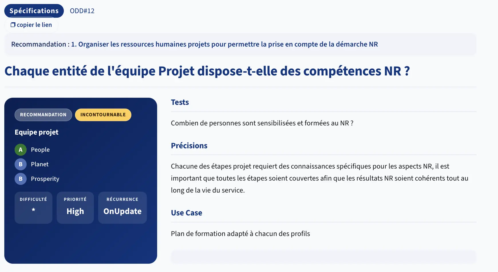

# Spécifications

> La meilleure ligne de code est celle qu'on n'écrit pas.

L'équipe produit de letter-flop a trois fonctionnalités en backlog.

> *À l'instinct : laquelle développeriez-vous en premier ? En silence, notez votre réponse.*

On y revient à la fin.

---

## Les principaux critères

La famille Spécifications pose **une seule question centrale** : *ce service, cette feature, ce composant doit-il vraiment exister ?*

Les 5 critères les plus structurants pour y répondre :

**2.3 - Le service est-il utilisable via une connexion bas débit ou hors connexion ?**

Connexion lente = zones rurales, transport, mobilité. 

> Si une feature ne fonctionne pas sur 3G, on exclut une partie des utilisateurs et on force les autres à consommer plus de données sans leur consentement.

**2.6 - Le service a-t-il été conçu avec une revue comprenant parmi ses objectifs la réduction des impacts de chaque fonctionnalité ?**

L'impact s'évalue *avant* de coder, pas en audit post-release. 

> Concrètement : a-t-on posé la question "quel est le coût environnemental de cette feature ?" au moment du refinement ou de la design review ?

**2.7 - Le service a-t-il prévu une stratégie de maintenance et de décommissionnement ?**

Construire sans plan de sortie, c'est du stockage fantôme garanti. 

> Les images générées, les logs accumulés, les données jamais supprimées, tout ça a un coût qui croît indéfiniment.

**2.9 - Le service a-t-il pris en compte les impacts environnementaux des composants d'interface prêts à l'emploi utilisés ?**

Chaque librairie, chaque player vidéo, chaque composant UI externe embarque des requêtes, du JavaScript et parfois du tracking. 

> Ce critère demande d'évaluer le coût *avant* d'inclure et de préférer les alternatives auto-hébergées ou plus légères.

**2.10 - Le service a-t-il pris en compte les impacts environnementaux des services tiers utilisés lors de leur sélection ?**

API d'IA générative, service vidéo, analytics : leur empreinte peut dépasser celle de tout l'hébergement du service. 

> L'impact environnemental doit être un critère de choix explicite, au même titre que le prix ou la latence.

---

## La grille d'arbitrage

Ces 5 critères forment une grille de décision applicable à n'importe quelle feature en backlog :

```
AVANT DE BUILDER UNE FEATURE

2.6  ← A-t-on évalué son impact avant de décider de la construire ?
2.3  ← Fonctionnera-t-elle pour tous les utilisateurs (débit, device) ?
2.9  ← Quels composants tiers embarque-t-elle - et à quel coût éco ?
2.10 ← Quels services tiers nécessite-t-elle - et à quel coût éco ?
2.7  ← Que se passe-t-il quand on décide de la supprimer ?
```

Si on ne peut pas répondre à ces questions au moment des spécifications, c'est un signal : la feature n'est peut-être pas prête à être développée.

---

## Arbitrage produit - 20 min

En groupes de 3.

Voici les trois fonctionnalités dans le backlog pour letter-flop :

---

**US-A - Génération d'une affiche personnalisée**

> En tant qu'utilisateur, je veux générer une affiche où mon visage remplace celui de l'acteur principal, pour partager sur les réseaux.

- Upload d'une photo de visage
- Génération via un modèle IA
- Image stockée sur le serveur
- Possibilité de régénérer si le résultat ne plaît pas

---

**US-B - Affiches HD + autoplay vidéo de la bande-annonce**

> En tant qu'utilisateur, je veux voir les affiches en très haute résolution et la bande-annonce en autoplay, pour une expérience immersive.

- Affiche en 2000×3000 px minimum
- Bande-annonce HD 1080p en autoplay, en boucle
- Préchargement de la vidéo dès le survol dans les résultats de recherche

---

**US-C - Logger un film via formulaire simple**

> En tant qu'utilisateur, je veux logger un film avec ma note et un commentaire, pour garder une trace de mon visionnage.

- Formulaire HTML léger (note + date + commentaire)
- Aucune image générée, pas de média auto-play
- Données stockées en base relationnelle

---

**Appliquez la grille pour chaque US :**

```markdown
| Critère | Question à se poser                                       | US-A | US-B | US-C |
|---------|------------------------------------------------------------|------|------|------|
| 2.6     | L'impact a-t-il été évalué avant de décider de builder ?   |      |      |      |
| 2.3     | Fonctionne-t-elle sur connexion lente ou vieux mobile ?    |      |      |      |
| 2.9     | Quels composants tiers embarque-t-elle ?                   |      |      |      |
| 2.10    | Quels services tiers nécessite-t-elle ?                    |      |      |      |
| 2.7     | Que devient la donnée produite si on déprécie la feature ? |      |      |      |
|         | **Décision : Builder / Retravailler / Abandonner**         |      |      |      |
```

**Questions guides :**
- *US-A / 2.10* : le modèle IA est un service tiers. 1 requête GenAI ≈ plusieurs centaines à milliers de requêtes web classiques. L'impact a-t-il été un critère de choix ?
- *US-A / 2.7* : si on décide d'arrêter la feature dans 6 mois, que fait-on des milliers d'images générées et stockées ?
- *US-B / 2.3* : l'autoplay démarre-t-il si l'utilisateur ne regarde pas ? Qui paie la bande passante ?
- *US-B / 2.9* : un player vidéo intégré, ça représente quoi en JavaScript, en requêtes, en tracking potentiel ?
- *US-C* : répondez aux 5 questions. Comparez avec US-A et US-B.

<details>
<summary>Correction</summary>

| Critère                              | US-A                                                   | US-B                                        | US-C                                         |
|--------------------------------------|--------------------------------------------------------|---------------------------------------------|----------------------------------------------|
| 2.6 - Impact évalué avant de builder | ✗                                                      | ✗                                           | ✓ (implicitement - c'est le cœur du produit) |
| 2.3 - Bas débit / vieux mobile       | ✗ - upload + génération requièrent réseau puissant     | ✗ - streaming 1080p impossible en 3G        | ✓ - 1 requête, 1 INSERT                      |
| 2.9 - Composants tiers               | ✗ - UI de génération, gestion upload, prévisualisation | ✗ - player vidéo embarqué                   | ✓ - aucun composant lourd                    |
| 2.10 - Services tiers                | ✗ - modèle GenAI (GPU, énergie, coût d'inférence)      | Partiel - TMDB video + YouTube non évalués  | ✓ - TMDB API déjà en place                   |
| 2.7 - Décommissionnement             | ✗ - images orphelines si feature dépréciée             | Partiel - médias externes (pas de stockage) | ✓ - suppression triviale                     |
| **Décision**                         | **✗ Abandonner**                                       | **Retravailler**                            | **✓ Builder**                                |


**Le retournement :** la feature la plus "impressionnante" (US-A) est celle qu'on abandonne. La plus sobre (US-C) est celle qu'on développe en premier.

Ce n'est pas un compromis entre qualité et écoconception, c'est une convergence : **le cœur du produit est aussi le geste le plus sobre**.

### US-B retravaillée - pas abandonnée

Le besoin derrière US-B est réel (découvrir visuellement un film). 

C'est l'implémentation qu'on rejette.

La spec doit changer avant que le code commence :

| Spec initiale                 | Spec conforme                                                 |
|-------------------------------|---------------------------------------------------------------|
| Affiche 2000×3000 px          | `w342` pour la fiche film, `w185` pour les vignettes          |
| Autoplay 1080p en boucle      | Thumbnail cliquable → lecture à la demande, sans boucle       |
| Préchargement vidéo au survol | `loading="lazy"` : pas de prefetch agressif                   |
| Player vidéo tiers intégré    | Lien vers YouTube (responsabilité transférée à l'utilisateur) |

Même valeur perçue. Impact divisé par 5 à 10. La famille `Spécifications` demande ça : challenger l'implémentation, pas le besoin.

## Mini-ACV - US-A en chiffres

> Le mieux serait d'arbitrer en faisant des mini-ACV (Analyse de Cycle de Vie) afin de factualiser les impacts.

On vient de décider d'abandonner US-A. Voici ce que les chiffres confirment.

**Hypothèses :**
- 1 million d'utilisateurs par jour
- 1 génération d'image par utilisateur : **3 à 10g CO2e** par génération
- Voiture thermique : **120g CO2e/km** (ADEME, Base Empreinte)

---

### Scénario de base - 1 génération par utilisateur

|                          | Bas (3g)           | Haut (10g)          |
|--------------------------|--------------------|---------------------|
| **Par jour**             | 3 000 kg CO2e      | 10 000 kg CO2e      |
| **Par an**               | **1 095 t CO2e**   | **3 650 t CO2e**    |
| Équiv. km voiture        | 9,1 millions de km | 30,4 millions de km |

---

### Scénario réaliste - avec régénérations

La spec dit *"possibilité de régénérer si le résultat ne plaît pas"*.
Si 30 % des utilisateurs régénèrent en moyenne 3 fois :

```
1 000 000 utilisateurs × 1 génération de base  = 1 000 000 générations
  300 000 utilisateurs × 2 régénérations supp. =   600 000 générations
                                                ─────────────────────
                         Total par jour         = 1 600 000 générations

        1 600 000 × 10g = 16 000 kg CO2e / jour
                        = 5 840 tonnes CO2e / an
```

---

### Mise en perspective avec US-C

Une interaction US-C (1 requête HTTP + 1 `INSERT` SQL, formulaire léger) ≈ **0,01g CO2e**.

|                     | US-A (base, 5g moy.)   | US-C            |
|---------------------|------------------------|-----------------|
| Par interaction     | 5g CO2e                | 0,01g CO2e      |
| Par jour (1M users) | 5 000 kg               | 10 kg           |
| Par an              | **1 825 t CO2e**       | **3,65 t CO2e** |
| **Ratio**           | **500× plus d'impact** | baseline        |

> **US-A génère 500 fois plus d'impact qu'US-C pour le même million d'utilisateurs.**
> Et US-C est le cœur du produit - celle qui répond au besoin réel.

---

### Ce que cette mini-ACV change

Sans ces chiffres, "IA générative c'est intéressant mais un peu coûteux" reste une opinion.
Avec ces chiffres, "1 800 tonnes CO2e/an pour un effet wow sur une app de journal de films" devient un arbitrage documenté.

C'est ça, la valeur d'une mini-ACV au stade des spécifications : **transformer une intuition en décision.**

</details>

---

## Et du côté du GR491 ?
La famille [Spécifications](https://gr491.isit-europe.org/?famille=specifications) 

[](https://gr491.isit-europe.org/crit.php?id=1-specifications-chacune-des-etapes-projet-requiert-des-connaissances-1ca708)

---

## Conclusion

```markdown
Ma priorité initiale : _______________

Ma priorité après la grille Spécifications : _______________

La question que je vais poser systématiquement en refinement dès la semaine prochaine :
_______________
```

---

## Ressources

- [RGESN - Famille Spécifications](https://ecoresponsable.numerique.gouv.fr/publications/referentiel-general-ecoconception/#specifications)
- [The Green Web Foundation - empreinte des services cloud](https://www.thegreenwebfoundation.org/)