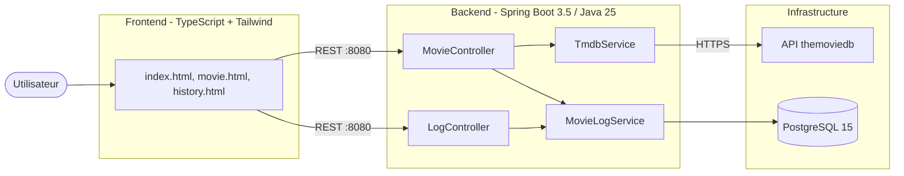
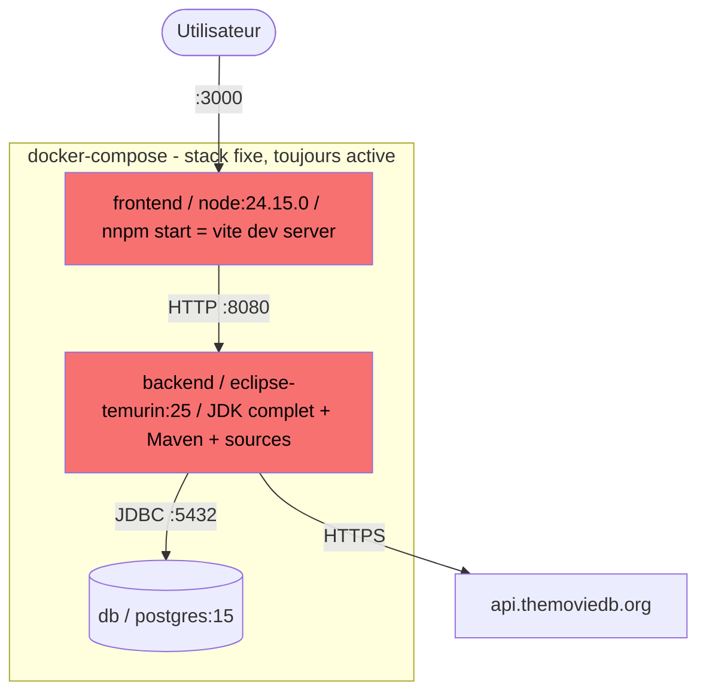
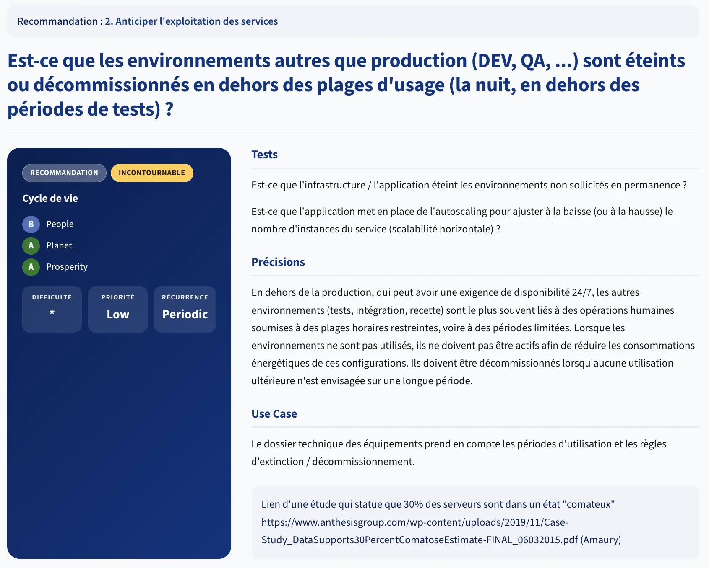

# Architecture

> La stratégie de conception et l'articulation des composants applicatifs entre frontend et backend.

> *Combien pèse l'image Docker de letter-flop en production ?*

Pariez un chiffre - on vérifie dans 5 minutes.

---

## L'architecture de letter-flop

### Vue logicielle



### Vue infrastructure



---

## Les critères

La famille Architecture pose la question des **choix structurants** : 
- est-ce que l'architecture elle-même est sobre ? 
- est-ce qu'elle transporte des coûts cachés qu'on n'a jamais remis en question ?

**3.1 - Le service repose-t-il sur une architecture et des composants conçus pour réduire leurs propres impacts environnementaux ?**

- L'image `eclipse-temurin:25` embarque le JDK complet : compilateur, outils de debug, sources, man pages.
  - en production, on n'a besoin que du JRE pour exécuter le `.jar` 
- Côté frontend : `node:24.15.0` + serveur `Vite` de développement servent le contenu en production
  - un serveur de dev, c'est conçu pour le rechargement à chaud et les sourcemaps, pas pour la performance et la frugalité

**3.2 - Le service fonctionne-t-il sur une architecture pouvant adapter la quantité de ressources utilisées à la consommation du service ?**

`docker-compose up` démarre les trois containers et les maintient actifs en permanence, quelle que soit la charge : un utilisateur ou mille. 

> Pas de scale-to-zero, pas d'autoscaling, pas d'adaptation. 
> Si personne n'utilise le service la nuit, les containers continuent de consommer CPU et mémoire.

**3.7 - Le service optimise-t-il la sollicitation des environnements de développement, de préproduction ou de test en fonction de ses besoins ?**

Un seul `docker-compose.yml` pour tout : dev, démo, et production potentielle. 
Pas de profil séparé, pas d'environnement de test isolé, pas de possibilité de démarrer uniquement la DB sans le frontend si on ne travaille que sur le backend. 

> Tous les services tournent ensemble, tout le temps.

**3.3 - Le service est-il en mesure de supporter l'évolution technique des protocoles ?**

Le frontend est servi par le serveur de développement `Vite` en HTTP/1.1. 
Pas de `HTTP/2`, pas de compression `brotli`, `pas de headers de cache`. 

> Un serveur nginx de production supporterait HTTP/2 nativement et multiplierait les performances réseau à coût constant, sans changer une ligne de code applicatif.

---

## Dans la pratique ?

### Mesurer avant de corriger

Construisez les images et observez leur poids réel. Depuis la racine de letter-flop :

```shell
# Construire toutes les images
docker compose build --no-cache

# Lister les images avec leur taille
docker images | grep letter-flop
```

Pour une vue plus détaillée par couche :

```shell
# Inspecter les couches du backend (identifier ce qui pèse)
docker history letter-flop-backend

# Inspecter les couches du frontend
docker history letter-flop-frontend
```

Pour comparer la taille compressée (ce qui transite réellement sur le réseau) :

```shell
# Taille de l'image (en octets bruts)
docker image inspect letter-flop-backend \
  --format '{{.Size}} bytes'

# Ou directement en format lisible (déjà humanisé par Docker)
docker images --format "{{.Repository}}:{{.Tag}} -> {{.Size}}" \
  | grep letter-flop-backend

# Pour toute la stack, en gardant l'en-tête du tableau
docker images --format "table {{.Repository}}\t{{.Tag}}\t{{.Size}}" \
  | { head -n1; grep -E "letter-flop|postgres|nginx|node|eclipse"; }
```

Notez les tailles observées :

```markdown
letter-flop-backend  : _______ MB
letter-flop-frontend : _______ MB
postgres:15         : _______ MB
Total               : _______ MB
```

<details>
<summary>Résultats et impacts</summary>

| Service   | Image de base      | Taille     |
|-----------|--------------------|------------|
| frontend  | node:24.15.0       | 904  MB    |
| backend   | eclipse-temurin:25 | 1.28 GB    |
| db        | postgres:15        | 445  MB    |
| **Total** |                    | `~2.63 GB` |

> 2,63 GB pour une application qui recherche des films et logger des visionnages....


Ce que ça coûte au transfert :
- **Premier `docker pull`** sur une machine CI ou un nouveau dev : `2-4` min à 100 Mbps avant d'avoir écrit une ligne de code
- **Registry** : chaque push stocke et transfère l'intégralité des couches
  - les images grosses saturent les quotas et ralentissent les pipelines
- **Démarrage à froid** : décompresser et charger 2,6 GB en mémoire avant de servir la première requête
- **Chaque développeur** clone 2,6 GB sur sa machine
  - multiplié par l'équipe, ça représente un transfert réseau significatif à chaque `docker compose pull`

Ce que ça coûte à l'hébergement (`docker compose up`, stack toujours active) :

| Ressource    | frontend (Vite dev) | backend (Spring Boot + JDK) | db (PostgreSQL)             | Total                  |
|--------------|---------------------|-----------------------------|-----------------------------|------------------------|
| **Stockage** | ~1 GB image         | ~800 MB image               | ~400 MB image + volume data | ~2,2 GB + données      |
| **RAM**      | ~300–400 MB         | ~500–800 MB                 | ~100–200 MB                 | **~1–1,4 GB**          |
| **CPU**      | idle mais alloué    | idle mais alloué            | idle mais alloué            | réservé même à 0 req/s |

> Trois containers actifs en permanence, qu'il y ait un utilisateur ou zéro. 
> La nuit, le week-end, pendant les vacances : la machine allouée tourne, la RAM est occupée, le CPU est réservé au scheduler. 

</details> 

---

### Le multi-stage build en 2 minutes

Un Dockerfile classique utilise une seule image pour tout : installer les outils de build, compiler, puis exécuter. 
Le résultat embarque le compilateur, les dépendances de dev, les sources, tout ça dans l'image finale.

Le `multi-stage build` sépare ça en deux étapes distinctes dans le même Dockerfile.
Plus d'explications [ici](https://docs.docker.com/build/building/multi-stage/).

---

### Réécrire les Dockerfiles - 40 min

En binôme. Ouvrez `backend/Dockerfile` et `frontend/Dockerfile` dans letter-flop.

**Étape 1 - Diagnostiquer**

Sans lancer Docker, répondez dans votre éditeur :

```markdown
Pourquoi apt-get install maven dans le Dockerfile backend est-il un problème ?
→ _______________

Pourquoi "npm start" dans le Dockerfile frontend est-il un problème en production ?
→ _______________

Quelle est la différence entre un JDK et un JRE ?
→ _______________
```

**Étape 2 - Corriger le Dockerfile backend**

Réécrivez `backend/Dockerfile` en multi-stage build :
- Stage 1 `build` : compiler le jar avec Maven
- Stage 2 : exécuter uniquement avec le JRE Alpine

```dockerfile
# Stage 1 - build
FROM _______________ AS build
WORKDIR /app
COPY pom.xml .
RUN _______________
COPY src ./src
RUN _______________

# Stage 2 - run
FROM _______________
WORKDIR /app
COPY --from=build _______________
CMD _______________
```

**Étape 3 - Corriger le Dockerfile frontend**

Réécrivez `frontend/Dockerfile` :
- Stage 1 `build` : compiler les assets TypeScript avec Vite
- Stage 2 : servir les assets statiques avec nginx

```dockerfile
# Stage 1 - build
FROM node:24.15.0-alpine AS build
WORKDIR /app
COPY package*.json ./
RUN _______________
COPY . .
RUN _______________

# Stage 2 - serve
FROM _______________
COPY --from=build _______________ _______________
EXPOSE 80
```

---

<details>
<summary>Correction</summary>

- **Backend / Dockerfile :**

```dockerfile
FROM maven:3.9-eclipse-temurin-25-alpine AS build
WORKDIR /app
COPY pom.xml .
RUN mvn dependency:go-offline
COPY src ./src
RUN mvn package -DskipTests

FROM eclipse-temurin:25-jre-alpine
WORKDIR /app
COPY --from=build /app/target/letterflop-0.0.1-SNAPSHOT.jar app.jar
EXPOSE 8080
CMD ["java", "-jar", "app.jar"]
```

- **Frontend / Dockerfile :**

```dockerfile
FROM node:24.15.0-alpine AS build
WORKDIR /app
COPY package*.json ./
RUN npm ci
COPY . .
RUN npm run build

FROM nginx:alpine
COPY --from=build /app/dist /usr/share/nginx/html
EXPOSE 80
```

### Servir le frontend : de Vite à nginx
L'application est désormais buildée puis servie par `nginx`, qui écoute sur le port **80** à l'intérieur du conteneur.

Cela change le port à exposer dans le `docker-compose.yml` : il faut mapper le port hôte sur le **80** du conteneur (et non plus sur le 3000) :

```yaml
frontend:
  ports:
    - "3000:80"   # hôte:conteneur - nginx écoute sur le 80
```

L'application reste donc accessible sur `http://localhost:3000` côté hôte, mais le trafic est routé vers nginx sur le port 80 en interne.

**Résultat attendu :**

| Service   | Avant      | Après       | Gain    |
|-----------|------------|-------------|---------|
| frontend  | 904  MB    | 62.4 MB     | −93 %   |
| backend   | 1.28 GB    | 284  MB     | −78 %   |
| db        | 445  MB    | 445  MB     | 0   %   |
| **Total** | `~2.63 GB` | `~791.4 MB` | `−80 %` |

**nginx : le gain caché au-delà du poids**

Passer de Vite dev à `nginx` ne réduit pas seulement la taille de l'image. 
nginx supporte nativement HTTP/2 et la compression brotli, sert les assets avec les bons headers de cache, et est conçu pour tenir la charge.

**Voir ce qu'il y a concrètement dans une image**

```shell
# Lister les couches et leur taille (ce qui a été ajouté à chaque instruction)
docker history letter-flop-frontend

# Explorer le système de fichiers de l'image (ce qui est réellement dedans)
docker run --rm -it letter-flop-frontend sh
ls /usr/share/nginx/html   # dans l'image corrigée : uniquement les assets compilés

# Pour l'image de base non corrigée - voir ce que Vite dev embarque
docker run --rm -it letter-flop-frontend sh
ls /app/node_modules | wc -l   # plusieurs centaines de paquets de dev
```

**Vérifier sur votre machine :**

```shell
# Rebuilder avec les Dockerfiles corrigés
docker compose build --no-cache

# Comparer avant / après
docker images --format "table {{.Repository}}\t{{.Size}}" \
  | grep -E "letter-flop|nginx"
```

> Et ce n'est pas une optimisation de performance : c'est retirer ce qui n'aurait jamais dû être là.

</details>

---

## Et du côté du GR491 ?
La famille [Architecture](https://gr491.isit-europe.org/?famille=architecture).

[](https://gr491.isit-europe.org/crit.php?id=2-architecture-en-dehors-de-la-production-qui-peut-51d36e)

---

## Pour conclure

Revenez sur votre pari initial, combien pensiez-vous que pesait l'image Docker de letter-flop ?

```markdown
Mon pari initial : _______________ MB

La réalité : ~800 MB backend / ~1 GB frontend

Ce que j'aurais pu réduire sans changer une ligne de code applicatif : _______________
```

---

## Ressources

- [RGESN - Famille Architecture](https://ecoresponsable.numerique.gouv.fr/publications/referentiel-general-ecoconception/#architecture)
- [Docker - Multi-stage builds](https://docs.docker.com/build/building/multi-stage/)
- [eclipse-temurin - Alpine JRE images](https://hub.docker.com/_/eclipse-temurin)
- [nginx:alpine - image officielle](https://hub.docker.com/_/nginx)
