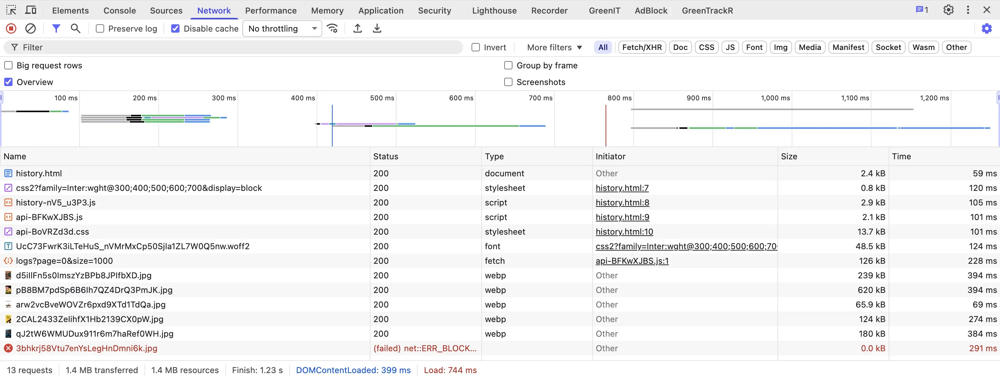
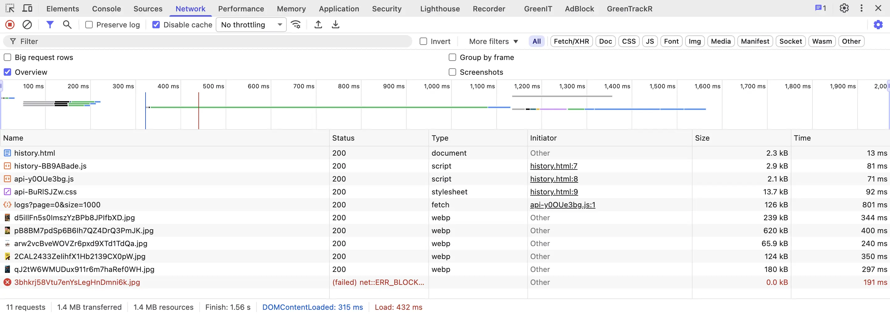
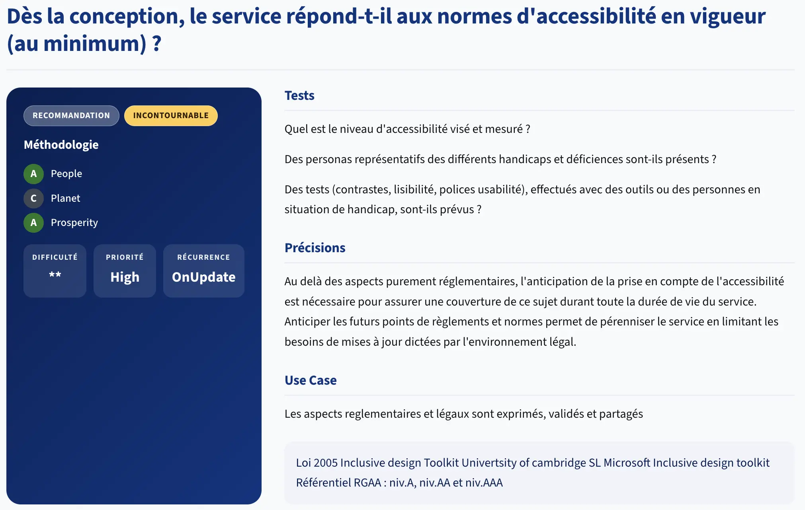

# UX/UI

> *Ouvrez `index.html` de letter-flop dans votre navigateur avec l'onglet Réseau ouvert (DevTools). 
> Combien de requêtes se déclenchent avant même de taper un seul caractère ?*

---

## Les critères

La famille UX/UI pose la question de l'**interface comme vecteur de consommation** : chaque police externe, chaque composant custom est un choix qui a un coût.

Les 4 critères les plus discriminants :

**4.1 – La lecture automatique des animations, vidéos et sons est-elle désactivée ?**

Ce critère bloque directement US-B du backlog. 
L'`autoplay 1080p` en boucle réclamé dans la spec initiale viole 4.1 : l'utilisateur ne choisit pas de consommer cette bande passante, le service décide pour lui.

La correction US-B (thumbnail cliquable → lecture à la demande) est exactement ce que demande ce critère.

**4.5 – Le service utilise-t-il majoritairement des composants natifs ?**

Un composant natif (`<input>`, `<select>`, `<button>`) est gratuit : le navigateur le rend, le gère, l'expose au clavier et aux lecteurs d'écran. 

> Un composant custom reconstruit tout ça en JavaScript.

Dans `movie.ts`, le widget de notation est construit avec des `<span>` et des `addEventListener('mouseenter')`; souris uniquement, inaccessible au clavier. 

> Un `<fieldset>` avec 5 radio buttons ou un `<input type="range">` font la même chose sans une ligne de JavaScript.

**4.8 – Le service limite-t-il le nombre de polices téléchargées ?**

`index.html` et `movie.html` chargent toutes les deux :

```html
<link href="https://fonts.googleapis.com/css2?family=Inter:wght@300;400;500;600;700&display=block" rel="stylesheet">
```

Trois problèmes superposés :
- **CDN externe** : 2 requêtes réseau (css + fichier font) avant que le navigateur puisse rendre le texte
- **5 graisses** (300, 400, 500, 600, 700) : en typographie, la *graisse* désigne l'épaisseur du trait (l'équivalent de `font-weight`).
  - Chaque variante est un fichier woff2 séparé
- **`display=block`** : bloque le rendu de tout le texte jusqu'au chargement complet de la fonte

> `Inter` est disponible en tant que police système sur macOS 13+, Windows 11, iOS 14+ et Android 12+. `font-family: system-ui, sans-serif;` l'utilise sans aucune requête réseau sur ces systèmes.

**4.9 – Le service limite-t-il les requêtes lors de la saisie ?**

Sur ce critère, letter-flop est conforme : la recherche se déclenche uniquement à la soumission du formulaire (événement `submit`), pas à chaque frappe.

La violation classique : écouter `input` ou `keyup` et appeler l'API à chaque keystroke. Sans debounce, 8 frappes pour "Star Wars" = 8 requêtes vers le backend, qui en fait 8 vers TMDB. 
Avec submit, c'est 1. Letter-flop fait le bon choix ici - à garder.

---

## Dans la pratique ?

### Mesurer avant de corriger

Ouvrez letter-flop dans votre navigateur avec l'onglet Réseau ouvert (DevTools → Network).

Rechargez la page `mon-historique` sans rien faire :

```markdown
Nombre de requêtes au chargement  : _____
Taille totale transférée          : _____
Requête la plus lente             : _____
Vers quel domaine ?               : _____
```

<details>
<summary>Résultats observés</summary>

Au chargement de `movie.html` sans aucune interaction :

```markdown
Nombre de requêtes au chargement  : 13
Taille totale transférée          : 1.4MB
Requête la plus lente             : https://image.tmdb.org/t/p/original/pB8BM7pdSp6B6Ih7QZ4DrQ3PmJK.jpg
Vers quel domaine ?               : tmdb.org
```



</details>

---

### Corriger les violations - 30 min

En binôme. Ouvrez `frontend/index.html`, `frontend/movie.html` et `frontend/src/pages/movie.ts`.

#### Étape 1 - Identifier les violations

Sans modifier le code, localisez dans les fichiers :

```markdown
Violation 4.8 - Où est chargée la police Google Fonts ?
→ Fichier(s) : _______________
→ Ligne(s)   : _______________
→ Quel est l'impact de display=block ?  _______________

Violation 4.5 - Où est construit le widget de notation ?
→ Fichier    : _______________
→ Ligne      : _______________
→ Pourquoi est-ce un problème ?    _______________
```

#### Étape 2 - Corriger 4.8 : supprimer Google Fonts

Dans `index.html` et `movie.html`, supprimez le `<link>` Google Fonts et remplacez la directive `font-family` :

```html
<!-- Avant (dans <head>) -->
<link href="https://fonts.googleapis.com/css2?family=Inter:wght@300;400;500;600;700&display=block"
      rel="stylesheet">
...
<body ... style="font-family: Inter, sans-serif;">

<!-- Après -->
<!-- [supprimer le <link>] -->
...
<body ... style="font-family: _______________;">
```

Rechargez l'onglet Réseau. Combien de requêtes vers Google restent-il ? `_______`

#### Étape 3 - Corriger 4.5 : composant natif

Le widget de notation dans `movie.ts` utilise des `<span>` cliquables à la souris. Proposez une alternative native dans le formulaire HTML :

```html
<!-- Option A : range input -->
<label for="rating">Note : <span id="rating-val">3</span>/5</label>
<input type="range" id="rating" name="rating" min="1" max="5" step="1" value="3"
       oninput="document.getElementById('rating-val').textContent = this.value" />

<!-- Option B : radio buttons (plus accessible, navigable au clavier) -->
<fieldset>
  <legend>Note</legend>
  <input type="radio" id="s1" name="rating" value="1" /><label for="s1">★ 1</label>
  <input type="radio" id="s2" name="rating" value="2" /><label for="s2">★ 2</label>
  <input type="radio" id="s3" name="rating" value="3" /><label for="s3">★ 3</label>
  <input type="radio" id="s4" name="rating" value="4" /><label for="s4">★ 4</label>
  <input type="radio" id="s5" name="rating" value="5" /><label for="s5">★ 5</label>
</fieldset>
```

<details>
<summary>Correction</summary>

**4.8 - system-ui**

```html
<!-- Supprimer le <link> Google Fonts dans index.html et movie.html -->
<body ... style="font-family: system-ui, -apple-system, sans-serif;">
```

Résultat : 0 requête vers `fonts.googleapis.com`. Le texte s'affiche immédiatement.

| Système         | Police rendue       |
|-----------------|---------------------|
| macOS / iOS     | San Francisco       |
| Windows 11      | Segoe UI            |
| Android 12+     | Roboto              |
| Linux           | Ubuntu / Cantarell  |

Chacun voit une police système native de qualité, sans transfert réseau, sans `display=block`.

**4.5 - radio buttons**

```html
<fieldset class="flex gap-1">
  <legend class="sr-only">Note sur 5</legend>
  <input type="radio" id="s1" name="rating" value="1" class="sr-only" />
  <label for="s1" title="1 étoile">★</label>
  <input type="radio" id="s2" name="rating" value="2" class="sr-only" />
  <label for="s2" title="2 étoiles">★</label>
  <input type="radio" id="s3" name="rating" value="3" class="sr-only" />
  <label for="s3" title="3 étoiles">★</label>
  <input type="radio" id="s4" name="rating" value="4" class="sr-only" />
  <label for="s4" title="4 étoiles">★</label>
  <input type="radio" id="s5" name="rating" value="5" class="sr-only" />
  <label for="s5" title="5 étoiles">★</label>
</fieldset>
```

Navigable au clavier (touches fléchées), lu par les lecteurs d'écran, zéro JavaScript. La couleur active se gère en CSS avec `input:checked ~ label`.



Sans toucher à une ligne de logique métier.

</details>

Pour rebuild le front :

```shell
docker-compose build --no-cache frontend
docker-compose up frontend
```

---

## Et du côté du GR491 ?
La famille [UX](https://gr491.isit-europe.org/?famille=uxui).

[](https://gr491.isit-europe.org/crit.php?id=4-uxui-au-dela-des-aspects-purement-reglementaires-lanticipation-7ec6ce)

---

## Pour conclure

Revenez sur votre pari initial :

```markdown
Mon pari initial                        : _____ requêtes au chargement
La réalité                              : 2 requêtes vers Google avant toute interaction

Ce que j'ai corrigé sans changer la logique métier :
→ 4.8 : _______________
→ 4.5 : _______________
```

---

## Ressources

- [RGESN - Famille UX/UI](https://ecoresponsable.numerique.gouv.fr/publications/referentiel-general-ecoconception/#ux-ui)
- [system-ui font stack - MDN](https://developer.mozilla.org/en-US/docs/Web/CSS/font-family)
- [Input radio - MDN](https://developer.mozilla.org/en-US/docs/Web/HTML/Reference/Elements/input/radio)
