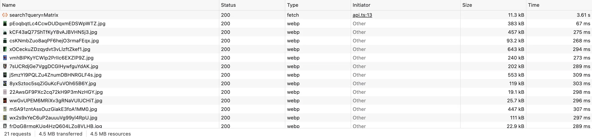
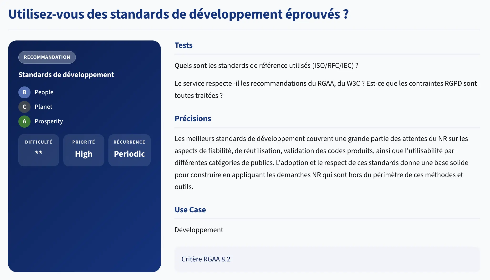

# Frontend

> Le frontend transporte ce que le service demande, pas ce dont il a besoin.

> *La page Historique de letter-flop affiche 6 films par page. Combien d'entrées charge-t-elle depuis le serveur pour construire cette liste ?*

---

## Les critères

La famille Frontend pose la question de ce qui **transite réellement sur le réseau** : chaque ressource chargée, chaque octet transféré a un coût - même si personne ne le voit.

Les 4 critères les plus discriminants :

**6.1 - Le service s'astreint-il à un poids maximum et une limite de requêtes par écran ?**

Un budget de performance, c'est un contrat avec l'utilisateur : cette page ne dépassera pas X Ko et Y requêtes. 

> C'est le critère-cadre : les violations 6.4 et 6.5 sont des dépassements de ce budget implicite.

**6.4 - Le service affiche-t-il des images dont les dimensions correspondent au contexte d'affichage ?**

Dans `TmdbService.java`, toutes les affiches sont construites avec la taille `original` :

```java
dto.setPosterPath("https://image.tmdb.org/t/p/original" + posterPath);
```

`original` chez TMDB, c'est `2000px` de large. Une vignette dans la grille de résultats mesure `200px`. 
Le navigateur télécharge `10×` plus de pixels que nécessaire, les décode, et en jette `90%`.

> TMDB expose des tailles calibrées : `w92`, `w185`, `w342`, `w500`, `w780`. 
> Choisir `w185` pour une vignette de 200px divise le poids par 10 à 20 sans changer l'affichage.

**6.5 - Le service évite-t-il de déclencher le chargement de ressources inutilisées ?**

Deux violations dans letter-flop, à deux niveaux :

*Niveau données - `history.ts` :*

```typescript
// Mauvaise pratique : charge 1000 logs pour en afficher 6
const data = await getLogs(0, 1000);
const allLogs = data.content;
const slice = allLogs.slice(page * PAGE_SIZE, (page + 1) * PAGE_SIZE);
```

La page Historique affiche 6 entrées par page. Elle demande les 1 000 premières au serveur, découpe côté client, et jette le reste. 

> Chez un utilisateur avec 200 logs : 194 logs transférés et ignorés à chaque changement de page.

*Niveau images - `search.ts` :*

```typescript
// les 20 affiches se chargent toutes en même temps

```

Sur 20 résultats, seuls 5 sont visibles à l'écran. Sans `loading="lazy"`, les 15 affiches sous le fold se chargent immédiatement. 

> L'attribut natif `loading="lazy"` diffère leur chargement jusqu'à ce qu'elles approchent du viewport.

**6.7 - Le service héberge-t-il ses ressources statiques sur un même domaine ?**

Un service qui charge ses ressources depuis plusieurs domaines paie deux fois :
- **Latence DNS** : chaque nouveau domaine déclenche une résolution DNS supplémentaire
- **Négociation TLS** : chaque domaine externe ouvre une connexion HTTPS séparée
- **Dépendance** : si `fonts.googleapis.com` est lent ou bloqué, votre page est en attente

`index.html` chargeait la police Inter depuis `fonts.googleapis.com` et `fonts.gstatic.com` (deux domaines externes). La correction 4.8 (UX/UI) a supprimé cet appel en passant à `system-ui`. C'est la solution la plus sobre. Si une police custom était nécessaire, l'alternative est de l'auto-héberger sur le même domaine que l'application.

---

## Dans la pratique ?

### Mesurer avant de corriger

**Mesure 1 - page de résultats**

Ouvrez letter-flop, activez l'onglet Réseau, recherchez "Matrix".

```markdown
Nombre d'images chargées simultanément : _____
Taille totale des images transférées   : _____
Combien sont visibles sans scroller ?  : _____
```

**Mesure 2 - page Historique**

Ouvrez la page Historique avec l'onglet Réseau. Observez la requête vers `/api/logs`.

```markdown
Paramètre `size` envoyé au serveur  : _____
Nombre d'entrées dans la réponse    : _____
Nombre d'entrées affichées à l'écran: _____
```

<details>
<summary>Observations</summary>


**Mesure 1 - page de résultats**



```markdown
Nombre d'images chargées simultanément : 20
Taille totale des images transférées   : 4.5MB
Combien sont visibles sans scroller ?  : 5
```

**Mesure 2 - page Historique**

```markdown
Paramètre `size` envoyé au serveur  : 1000
Nombre d'entrées dans la réponse    : 331
Nombre d'entrées affichées à l'écran: 6
```

La requête réseau montre `/api/logs?page=0&size=1000`. 
Le serveur répond avec l'intégralité des logs.
À chaque clic "page suivante", la même requête est rejouée.

</details>

---

### Corriger les violations - 40 min

En binôme. Ouvrez `backend/src/main/java/com/yot/letterflop/service/TmdbService.java`, `frontend/src/pages/history.ts`, et `frontend/src/pages/search.ts`.

**Étape 1 - Identifier les violations**

```markdown
Violation 6.4 - Où est construite l'URL de l'affiche ?
→ Fichier : _______________
→ Ligne   : _______________
→ Quelle taille est utilisée ?                     _______________
→ Quelle taille pour une vignette de 200px ?       _______________
→ Quelle taille pour une fiche détail (~220px) ?   _______________

Violation 6.5a - Combien d'entrées `history.ts` charge-t-il ?
→ Ligne                    : _______________
→ Quel paramètre corriger ? : _______________
```

**Étape 2 - Corriger 6.4 : tailles TMDB calibrées**

Dans `TmdbService.java`, l'URL `original` est construite de la même façon pour les résultats de recherche et pour la fiche détail. TMDB est appelé dans deux méthodes distinctes.

Trouvez les deux appels et appliquez la bonne taille à chacun :

```java
// Pour les résultats de recherche (vignette ≤ 200px)
"https://image.tmdb.org/t/p/_______" + posterPath

// Pour la fiche détail (affiche ~220px)
"https://image.tmdb.org/t/p/_______" + posterPath
```

**Étape 3 - Corriger 6.5a : pagination serveur**

Dans `history.ts`, remplacez la fausse pagination client par une vraie pagination serveur :

```typescript
// Avant : charge tout, découpe côté client
const data = await getLogs(0, 1000);
const allLogs = data.content;
const slice = allLogs.slice(page * PAGE_SIZE, (page + 1) * PAGE_SIZE);

// Après : demande uniquement la page nécessaire
const data = await getLogs(_______________, _______________);
const slice = data.content;
```

Vérifiez dans `api.ts` la signature de `getLogs` pour confirmer les paramètres.

**Étape 4 - Corriger 6.5b : lazy loading**

Dans `search.ts`, ajoutez l'attribut `loading="lazy"` sur les balises `` des résultats :

```typescript
// Avant
``

// Après
``
```

Rechargez l'onglet Réseau après une recherche. Combien d'images se chargent au premier affichage ? `_______`

<details>
<summary>Correction</summary>

**6.4 - TmdbService.java**

```java
// Résultats de recherche (méthode searchMovies / buildSearchResultDto)
dto.setPosterPath("https://image.tmdb.org/t/p/w185" + posterPath);

// Fiche détail (méthode getMovieDetail / buildDetailDto)
dto.setPosterPath("https://image.tmdb.org/t/p/w342" + posterPath);
```

Gain : une affiche `original` ≈ 200-400 KB → `w185` ≈ 10-20 KB.
Sur 20 résultats : 4-8 MB → 200-400 KB transférés. Divisé par 20.

**6.5a - history.ts**

```typescript
const data = await getLogs(page, PAGE_SIZE);
const slice = data.content;
```

Et supprimer le bloc de découpage client :

```typescript
// Supprimer ces deux lignes
const allLogs = data.content;
const slice = allLogs.slice(page * PAGE_SIZE, (page + 1) * PAGE_SIZE);
```

Le backend expose déjà `getLogs(page, size)` - la pagination serveur est déjà implémentée. Il suffisait de l'utiliser.

**6.5b - search.ts**

```typescript
``
```

Le navigateur gère le reste : les images visibles chargent immédiatement, les suivantes chargent au scroll.

**Mesure 1 - page de résultats**


```markdown
Nombre d'images chargées simultanément : 20
Taille totale des images transférées   : 274KB
Combien sont visibles sans scroller ?  : 5
```

**Mesure 2 - page Historique**

```markdown
Paramètre `size` envoyé au serveur  : 6
Nombre d'entrées dans la réponse    : 6
Nombre d'entrées affichées à l'écran: 6
```

**Résultat cumulé :**

| Correction      | Avant                             | Après                         | Gain                   |
|-----------------|-----------------------------------|-------------------------------|------------------------|
| 6.4 Images      | `original` ≈ 300 KB × 20          | `w185` ≈ 15 KB × 20           | −95 % par image        |
| 6.5a Historique | 1 000 logs transférés, 6 affichés | 6 logs transférés, 6 affichés | −99 % sur la donnée    |
| 6.5b Lazy       | 20 images au chargement           | ~5 images au chargement       | −75 % au premier rendu |

### Convertir des images en WebP

[ImageMagick](https://imagemagick.org) est un outil en ligne de commande disponible sur toutes les plateformes. La commande de base est simple :

```bash
magick input.png -quality 82 output.webp
```

Le paramètre `-quality` en WebP ne fonctionne pas comme en JPEG : une valeur autour de `80-85` donne un excellent rapport qualité/poids pour du contenu photographique. 
En dessous de `75`, des artefacts apparaissent. 

```bash
# macOS
brew install imagemagick

# Ubuntu / Debian
sudo apt install imagemagick

# Fedora / RHEL
sudo dnf install imagemagick

# Windows (winget)
winget install ImageMagick.ImageMagick

# Windows (Chocolatey)
choco install imagemagick
```

Au-dessus de `90`, les gains par rapport au JPEG deviennent négligeables.

Pour convertir un répertoire entier en une seule passe, voici un script prêt à l'emploi :Le script traite uniquement les fichiers du premier niveau du répertoire (`-maxdepth 1`) pour éviter les conversions récursives accidentelles. 
Il ignore les fichiers `.webp` déjà existants, affiche le gain en pourcentage pour chaque image, et remonte une synthèse en fin de run.

```bash
# Convertir le dossier img/ avec qualité par défaut (82)
./convert_to_webp.md ./img

# Qualité personnalisée pour des icônes (contenu à bords nets : monter à 90)
./convert_to_webp.md ./img/icons 90
```

Récupérer le script [ici](scripts/convert_to_webp.md).

</details>

---

## Et du côté du GR491 ?
La famille [Front-end](https://gr491.isit-europe.org/?famille=frontend).

[](https://gr491.isit-europe.org/crit.php?id=1-frontend-les-meilleurs-standards-de-developpement-couvrent-une-c3efe3)

---

## Ressources

- [RGESN - Famille Frontend](https://ecoresponsable.numerique.gouv.fr/publications/referentiel-general-ecoconception/#frontend)
- [TMDB image sizes](https://developer.themoviedb.org/docs/image-basics)
- [loading=lazy - MDN](https://developer.mozilla.org/en-US/docs/Web/Performance/Guides/Lazy_loading)
