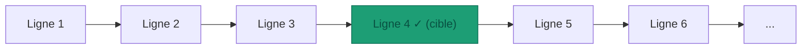
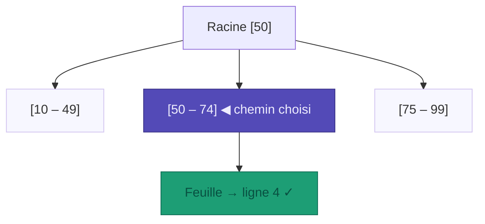
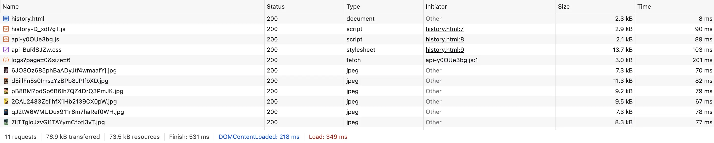
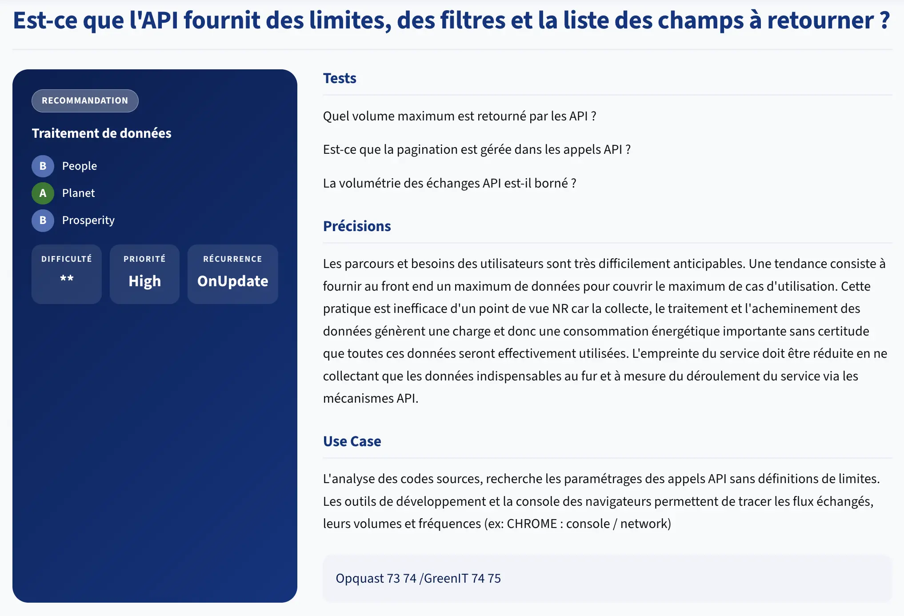

# Backend

> *La méthode `getAllLogs(page, size)` reçoit deux paramètres de pagination. Regardez son implémentation dans `MovieLogService.java`. 
> Combien de requêtes SQL envoie-t-elle vers la base de données ?*

---

## Les critères

La famille Backend pose la question des **ressources consommées côté serveur** :chaque requête SQL, chaque appel externe, chaque donnée qui s'accumule a un coût qui croît avec le temps.

Les 3 critères les plus discriminants :

**7.1 – Le service a-t-il recours à un système de cache pour les données les plus utilisées ?**

Le cache évite de recalculer ou re-`fetch` ce qui n'a pas changé. 
Sans cache, chaque requête identique déclenche le même travail : appel réseau, requête SQL, décodage JSON.

Deux absences de cache dans letter-flop :

*Appels TMDB non cachés :*
Une recherche "Matrix" dans letter-flop déclenche 1 appel TMDB pour la liste, puis 1 appel supplémentaire par film pour récupérer le réalisateur - introuvable dans les résultats de recherche TMDB. 

> Soit **N+1 appels** vers l'API externe pour N résultats.

10 utilisateurs cherchent "Matrix" simultanément → 10 × 21 = **210 appels vers TMDB** pour une requête identique.

La correction : **Spring Cache**. Deux annotations suffisent pour court-circuiter les appels répétés.

```java
// LetterflopApplication.java
@EnableCaching          // ← activer le cache une seule fois

// TmdbService.java
@Cacheable("movies-search")                 // ← clé = query
public List<MovieSearchResultDto> searchMovies(String query) { ... }

@Cacheable("movies-detail")                 // ← clé = tmdbId
public MovieDetailDto getMovieDetail(Integer tmdbId) { ... }
```

Le premier appel exécute la méthode et stocke le résultat. Les suivants retournent la valeur en mémoire sans toucher à TMDB. Par défaut Spring utilise un `ConcurrentHashMap` (pas d'expiration). Pour un cache avec TTL, on ajoute **Caffeine** :

```properties
# application.properties
spring.cache.type=caffeine
spring.cache.caffeine.spec=maximumSize=500,expireAfterWrite=1h
```

*Requêtes SQL non optimisées :*
`getAllLogs` charge toute la table en mémoire à chaque appel, trie en Java, puis découpe. 

La base de données n'est jamais interrogée pour un sous-ensemble, elle livre tout et laisse le serveur faire le travail.

*Index absents :*
`MovieLogRepository` expose `findByTmdbId(Integer tmdbId)` - requête exécutée à chaque ouverture d'une fiche film. 
Sans index sur `tmdb_id`, PostgreSQL effectue un **full table scan** : il lit chaque ligne de la table une par une jusqu'à trouver celles qui correspondent - comme chercher un mot dans un livre sans sommaire ni index. 

Même chose pour le tri par `watched_at` : sans index, PostgreSQL charge toutes les lignes puis les trie en mémoire.

| Requête                                     | Sans index     | Avec index       |
|---------------------------------------------|----------------|------------------|
| `WHERE tmdb_id = ?`                         | O(n) full scan | O(log n) B-tree  |
| `ORDER BY watched_at DESC, created_at DESC` | tri en mémoire | lecture ordonnée |

> Avec 10 000 logs, la différence est invisible. Avec 1 million, c'est un autre ordre de grandeur.

### Full Table Scan O(n) vs Lecture B-tree O(log n)
Quand une base de données cherche une ligne, elle a deux stratégies principales :

- **Full table scan** : lire chaque ligne de la table de haut en bas jusqu'à trouver la valeur.
- **Lecture B-tree** : suivre un arbre équilibré depuis la racine jusqu'à une feuille, en éliminant la moitié des candidats à chaque niveau.

#### Full Table Scan - O(n)

Le moteur parcourt toutes les lignes séquentiellement. Sur une table de `n` lignes, il peut faire jusqu'à `n` lectures.



> Pire cas : toutes les lignes sont lues avant de trouver (ou ne pas trouver) la valeur.

#### Lecture B-tree - O(log n)

L'index B-tree organise les valeurs dans un arbre équilibré. La recherche descend de la racine vers une feuille en 3–4 niveaux maximum, même sur des millions de lignes.



> Sur 8 lignes : log₂(8) = **3 comparaisons**. Sur 1 million : log₂(1 000 000) ≈ **20 comparaisons**.

#### Comparaison de complexité

| n (lignes) | 🔴 Full scan O(n) | 🟢 B-tree O(log₂ n) |  Ratio  |
|:----------:|:-----------------:|:-------------------:|:-------:|
|   1 000    |       1 000       |         10          |  ×100   |
|   10 000   |      10 000       |         13          |  ×769   |
|  100 000   |      100 000      |         17          | ×5 882  |
| 1 000 000  |     1 000 000     |         20          | ×50 000 |

**7.2 – Le service met-il en place des durées de conservation sur les données ?**

L'entité `MovieLog` possède un champ `createdAt` - mais aucun `expiresAt`, aucune politique de purge, aucun job d'archivage.

```java
// MovieLog.java - aucune politique de rétention
private LocalDateTime createdAt;
// expiresAt ?  → absent
// archivedAt ? → absent
```

Les logs s'accumulent indéfiniment. Un utilisateur actif depuis 5 ans : des milliers d'entrées, chaque `findAll()` de plus en plus lent, chaque backup de plus en plus lourd.

> Construire sans plan de sortie, c'est du stockage fantôme garanti.

*Données stockées au mauvais niveau de granularité :*

Chaque `MovieLog` persiste l'URL complète de l'affiche avec la taille TMDB dedans :

```java
// Ce qui est stocké en base aujourd'hui
posterPath = "https://image.tmdb.org/t/p/original/pB8BM7pdSp6B6Ih7QZ4DrQ3PmJK.jpg"
//                                      ^^^^^^^^ taille dans la donnée
```

La correction 6.4 (Frontend) a changé `original` en `w185` côté service, mais les logs déjà en base gardent leurs URLs en `original`. 
Chaque changement de résolution d'affichage nécessite une migration de toutes les lignes existantes.

La règle : **stocker l'identifiant canonique, construire l'URL à l'affichage**.

```java
// Stocker uniquement le chemin TMDB
posterPath = "/pB8BM7pdSp6B6Ih7QZ4DrQ3PmJK.jpg"

// Construire l'URL au moment de sérialiser la réponse
String url = "https://image.tmdb.org/t/p/w185" + log.getPosterPath();
```

> Avantages : la résolution devient un choix de présentation découplé des données, zéro migration si on change la taille, la donnée stockée est plus courte.

**7.3 – Le service informe-t-il l'utilisateur d'un traitement en arrière-plan ?**

Ce critère vise les traitements longs (export, génération, envoi d'email) qui tournent en tâche de fond pendant que l'utilisateur attend. L'informer évite qu'il relance plusieurs fois la même action.

Letter-flop n'a pas de traitement asynchrone - mais US-A (génération d'image IA, abandonnée) en aurait nécessité un. La génération prend 5 à 30 secondes : sans feedback, l'utilisateur clique trois fois, déclenche trois générations, multiplie par trois l'empreinte.

> L'absence de feedback n'est pas neutre : elle provoque des doublons par impatience.

---

## Dans la pratique ?

### Mesurer avant de corriger

**Mesure réseau - page Historique**

Ouvrez letter-flop, activez l'onglet Réseau (DevTools → Network → filtre `Fetch/XHR`), puis ouvrez la page Historique.

```markdown
URL de la requête vers /api/logs        : _____________________________
Paramètre size envoyé                   : _____
Taille de la réponse JSON               : _____
Nombre d'entrées dans content[]         : _____
Nombre d'entrées affichées à l'écran    : _____

Inspectez un élément de content[] :
→ Valeur de posterPath                  : _____________________________
→ Taille de l'image ?  : _____
```

<details>
<summary>Résultats observés</summary>

```markdown
URL de la requête vers /api/logs        : http://localhost:8080/api/logs?page=0&size=6
Paramètre size envoyé                   : 6
Taille de la réponse JSON               : 3.1kB
Nombre d'entrées dans content[]         : 6
Nombre d'entrées affichées à l'écran    : 6

Inspectez un élément de content[] : "Pulp Fiction"
→ Valeur de posterPath                  : https://image.tmdb.org/t/p/original/d5iIlFn5s0ImszYzBPb8JPIfbXD.jpg
→ Taille de l'image ?  : 239kB
```

La taille `original` est fixe dans chaque URL stockée. Changer la résolution d'affichage → migrer toutes les lignes.

</details>

---

**Mesure code - `MovieLogService.java`**

Ouvrez `MovieLogService.java` et lisez attentivement `getAllLogs` :

```markdown
Combien d'appels à repository.findAllOrderByWatchedAtDesc() ?  _____
Comment getTotalCount() compte-t-il les entrées ?               _____
```

> Listez les `Code Smells`.

<details>
<summary>Observations</summary>

```java
public List<MovieLogDto> getAllLogs(int page, int size) {
    List<MovieLog> allLogs = repository.findAllOrderByWatchedAtDesc(); // ← appel #1 : inutilisé

    List<MovieLog> sorted = allLogs.stream()                          // ← tri en Java
            .sorted(...)
            .collect(Collectors.toList());

    int start = page * size;
    int end   = Math.min(start + size, sorted.size());

    if (start >= sorted.size()) return new ArrayList<>();

    return repository.findAllOrderByWatchedAtDesc().stream()           // ← appel #2 : la même chose
            .sorted(...)
            .toList()
            .subList(start, Math.min(start + size, end))              // ← pagination en Java
            .stream().map(...)
            .toList();
}

public int getTotalCount() {
    return (int) repository.findAll().size();                          // ← charge TOUT pour compter
}
```

**2 requêtes SQL** qui chargent toute la table. La première n'est même pas utilisée.
`getTotalCount()` charge toutes les entités en mémoire pour renvoyer un entier.

Avec 10 000 logs : 3 full table scans par page chargée.

</details>

---

### Corriger les violations - 35 min

En binôme. Ouvrez `MovieLogService.java`, `MovieLogRepository.java` et `MovieLog.java`.

**Étape 1 - Identifier les violations**

```markdown
Violation 7.1a - Combien d'appels SQL dans getAllLogs ?
→ Ligne des appels    : _______________
→ La pagination est faite où ? _______________
→ Que retourne le premier appel ligne 24 ? _______________

Violation 7.1b - getTotalCount()
→ Quelle méthode JPA utiliser à la place de findAll().size() ?
→ _______________

Violation 7.2a - MovieLog (rétention)
→ Quel champ manque dans l'entité pour implémenter une rétention ?
→ _______________

Violation 7.2b - posterPath
→ Qu'est-ce qui est stocké en base aujourd'hui ?          _______________
→ Qu'est-ce qui devrait l'être à la place ?               _______________
→ Où reconstruire l'URL complète ?                        _______________
```

**Étape 2 - Corriger 7.1a : pagination SQL**

Spring Data JPA expose `Pageable` pour déléguer tri et pagination à la base de données. Adaptez le repository et le service :

```java
// MovieLogRepository.java - avant
@Query("SELECT m FROM MovieLog m ORDER BY m.watchedAt DESC, m.createdAt DESC")
List<MovieLog> findAllOrderByWatchedAtDesc();

// Après - une seule requête SQL, triée et paginée par la DB
Page<MovieLog> findAllByOrderByWatchedAtDescCreatedAtDesc(_______________);
```

```java
// MovieLogService.java - avant
public List<MovieLogDto> getAllLogs(int page, int size) {
    List<MovieLog> allLogs = repository.findAllOrderByWatchedAtDesc();
    // ... tri en Java, pagination en Java, deux appels ...
}

// Après - une seule requête, zéro tri en Java
public Page<MovieLogDto> getAllLogs(int page, int size) {
    Pageable pageable = PageRequest.of(_______________, _______________);
    return repository.findAllByOrderByWatchedAtDescCreatedAtDesc(pageable)
            .map(this::toDto);
}
```

**Étape 2b - Ajouter les index manquants**

Vérifiez d'abord les index existants sur la table :

```sql
-- Lister les index sur movie_logs
SELECT indexname, indexdef
FROM pg_indexes
WHERE tablename = 'movie_logs';
```

```markdown
Index trouvés : _____________________________
Index manquants identifiés : _____________________________
```

Créez les index manquants, soit en SQL :

```sql
-- Index sur tmdb_id (utilisé par findByTmdbId)
CREATE INDEX IF NOT EXISTS _______________ ON movie_logs(_______________);

-- Index composite sur watched_at + created_at (utilisé par ORDER BY)
CREATE INDEX IF NOT EXISTS _______________ ON movie_logs(_______________, _______________);
```

Soit en annotant l'entité JPA pour que les index soient créés/documentés avec le schéma :

```java
// MovieLog.java
@Entity
@Table(
    name = "movie_logs",
    indexes = {
        @Index(name = "idx_movie_logs_tmdb_id",    columnList = "_______________"),
        @Index(name = "idx_movie_logs_watched_at",  columnList = "_______________, _______________")
    }
)
public class MovieLog { ... }
```

<details>
<summary>Correction</summary>

```sql
CREATE INDEX IF NOT EXISTS idx_movie_logs_tmdb_id
    ON movie_logs(tmdb_id);

CREATE INDEX IF NOT EXISTS idx_movie_logs_watched_at
    ON movie_logs(watched_at DESC, created_at DESC);
```

```java
@Table(
    name = "movie_logs",
    indexes = {
        @Index(name = "idx_movie_logs_tmdb_id",   columnList = "tmdb_id"),
        @Index(name = "idx_movie_logs_watched_at", columnList = "watched_at DESC, created_at DESC")
    }
)
```

L'annotation JPA documente l'intention dans le code et génère le DDL via `spring.jpa.hibernate.ddl-auto`. 

> En production, on préférera un outil de migration dédié (Flyway, Liquibase) pour contrôler le moment de création et éviter les lock tables.

</details>

**Étape 2c - Mettre en cache les appels TMDB**

Ouvrez `LetterflopApplication.java` et `TmdbService.java`.

```java
// Étape 1 : activer le cache dans LetterflopApplication.java
@SpringBootApplication
@EnableCaching              // ← ajouter cette annotation
public class LetterflopApplication { ... }
```

```xml
<!-- pom.xml : ajouter la dépendance cache -->
<dependency>
    <groupId>org.springframework.boot</groupId>
    <artifactId>spring-boot-starter-cache</artifactId>
</dependency>
```

Annotez les deux méthodes de `TmdbService` qui appellent TMDB :

```java
// TmdbService.java

// Pour la recherche : même requête "Matrix" → même résultat mis en cache
@Cacheable("_______________")
public List<MovieSearchResultDto> searchMovies(String query) { ... }

// Pour le détail : même tmdbId → même film mis en cache
@Cacheable("_______________")
public MovieDetailDto getMovieDetail(Integer tmdbId) { ... }
```

Testez : effectuez deux fois la même recherche. Observez dans les logs si l'appel TMDB est rejoué.

```markdown
Première recherche "Matrix" : appel TMDB déclenché ?  _____
Deuxième recherche "Matrix" : appel TMDB déclenché ?  _____
```

Pour configurer un TTL (les données TMDB évoluent) :

```xml
<!-- pom.xml : Caffeine pour le cache avec expiration -->
<dependency>
    <groupId>com.github.ben-manes.caffeine</groupId>
    <artifactId>caffeine</artifactId>
</dependency>
```

```properties
# application.properties
spring.cache.type=caffeine
spring.cache.caffeine.spec=maximumSize=500,expireAfterWrite=1h
```

```markdown
Pourquoi 1h et pas indéfiniment ?
→ _______________
```

**Étape 3 - Corriger 7.1b : count SQL**

```java
// MovieLogService.java - avant
public int getTotalCount() {
    return (int) repository.findAll().size(); // charge tout
}

// Après - une seule requête COUNT(*)
public long getTotalCount() {
    return _______________;
}
```

**Étape 4 - Corriger 7.2b : stocker le chemin, pas l'URL**

Dans `CreateLogRequest.java` et `MovieLog.java`, le champ `posterPath` reçoit aujourd'hui une URL complète. Tracez où la transformation doit s'opérer :

```java
// Où stocker uniquement le chemin TMDB (ex: "/pB8BM7pd.jpg") ?
// → dans la couche : _______________

// Où reconstruire l'URL avec la bonne taille ?
// → dans la couche : _______________
// → pour la liste historique (vignette 60px)  : taille _______
// → pour la fiche film      (affiche 220px)   : taille _______
```

La correction code s'applique aux **nouveaux logs**. Les logs déjà en base conservent leurs URLs complètes. Il faut une migration SQL pour les données existantes.

Écrivez le script SQL qui supprime le préfixe TMDB sur toutes les lignes existantes :

```sql
-- Avant migration : "https://image.tmdb.org/t/p/original/pB8BM7pd.jpg"
-- Après migration : "/pB8BM7pd.jpg"

UPDATE movie_logs
SET poster_path = _______________
WHERE poster_path LIKE 'https://image.tmdb.org/t/p/%';

-- Vérifier le résultat
SELECT id, poster_path FROM movie_logs LIMIT 5;
```

Pour l'exécuter sur le conteneur PostgreSQL de letter-flop :

```shell
# Copier le script dans le conteneur et l'exécuter
docker exec -i letter-flop_db_1 psql -U letterflop -d letterflop < migration_poster_path.sql

# Ou directement en une ligne
docker exec letter-flop_db_1 psql -U letterflop -d letterflop \
  -c "UPDATE movie_logs SET poster_path = _______________
      WHERE poster_path LIKE 'https://image.tmdb.org/t/p/%';"
```

**Étape 5 - Concevoir 7.2a : politique de rétention**

Sans écrire le code, répondez pour letter-flop :

```markdown
Durée de conservation pertinente pour un log de visionnage :
→ _______________

Comportement à l'expiration (choisissez un) :
□ Suppression automatique
□ Archivage (table séparée, accès lecture seule)
□ Anonymisation (garder la note, supprimer le commentaire)

Champ à ajouter dans MovieLog :
→ _______________

Comment déclencher la purge ?
□ Job @Scheduled Spring (ex: toutes les nuits à 2h)
□ Trigger SQL (cron PostgreSQL)
□ À la connexion de l'utilisateur
```

<details>
<summary>Correction</summary>

**7.1 - Cache Spring (Étape 2c)**

```java
// LetterflopApplication.java
@SpringBootApplication
@EnableCaching
public class LetterflopApplication { ... }
```

```java
// TmdbService.java
@Cacheable("movies-search")
public List<MovieSearchResultDto> searchMovies(String query) { ... }

@Cacheable("movies-detail")
public MovieDetailDto getMovieDetail(Integer tmdbId) { ... }
```

```xml
<!-- pom.xml -->
<dependency>
    <groupId>org.springframework.boot</groupId>
    <artifactId>spring-boot-starter-cache</artifactId>
</dependency>
<dependency>
    <groupId>com.github.ben-manes.caffeine</groupId>
    <artifactId>caffeine</artifactId>
</dependency>
```

```properties
# application.properties
spring.cache.type=caffeine
spring.cache.caffeine.spec=maximumSize=500,expireAfterWrite=1h
```

**Pourquoi 1h et pas indéfiniment ?** Les données TMDB peuvent changer (affiche modifiée, réalisateur corrigé). Un TTL de 1h garantit que le cache reste cohérent avec la source sans interroger TMDB à chaque requête.

Comportement après cache :
- Première recherche "Matrix" → appel TMDB + N appels détail → stocké en cache
- Deuxième recherche "Matrix" → 0 appel TMDB, retour mémoire en < 1 ms
- 10 utilisateurs cherchent "Matrix" → toujours 0 appel TMDB (tant que le cache est chaud)

> Le cache ne résout pas le N+1 — il l'amortit. La vraie correction du N+1 est d'enrichir la réponse de l'API TMDB (credits dans la même requête) ou de ne pas stocker le réalisateur dans les résultats de recherche. Le cache est le filet de sécurité.

**7.1a - Pageable**

```java
// MovieLogRepository.java
import org.springframework.data.domain.Page;
import org.springframework.data.domain.Pageable;

Page<MovieLog> findAllByOrderByWatchedAtDescCreatedAtDesc(Pageable pageable);
```

```java
// MovieLogService.java
public Page<MovieLogDto> getAllLogs(int page, int size) {
    Pageable pageable = PageRequest.of(page, size);
    return repository
            .findAllByOrderByWatchedAtDescCreatedAtDesc(pageable)
            .map(this::toDto);
}
```

1 requête SQL avec `ORDER BY` + `LIMIT` + `OFFSET`. Le tri et la pagination sont faits en base. La méthode `toDto` existante est réutilisée telle quelle.

**7.1b - count()**

```java
public long getTotalCount() {
    return repository.count();
}
```

`count()` émet `SELECT COUNT(*) FROM movie_logs`. Zéro entité chargée en mémoire.

**7.2b - posterPath**

La transformation doit s'opérer dans la couche service, lors de la création du log :

*Migration des données existantes :*

```sql
-- migration_poster_path.sql
-- Supprime le préfixe TMDB pour ne garder que le chemin relatif
UPDATE movie_logs
SET poster_path = regexp_replace(
    poster_path,
    '^https://image\.tmdb\.org/t/p/[^/]+',
    ''
)
WHERE poster_path LIKE 'https://image.tmdb.org/t/p/%';

-- Vérification
SELECT id, title, poster_path FROM movie_logs LIMIT 5;
```

```shell
# Exécution sur le conteneur Docker
docker exec -i letter-flop-db-1 psql -U letterflop -d letterflop \
  < migration_poster_path.sql
  
Si besoin : 

# Index
docker exec -i letter-flop_db_1 psql -U postgres -d letterflop < db/updates/add_indexes.sql

# Migration posterPath
docker exec -i letter-flop_db_1 psql -U postgres -d letterflop < db/updates/migrate_poster_path.sql

Pour une base neuve (docker-compose down -v && up), init.sql crée déjà la table, les index et insère les chemins relatifs (les scripts updates/ ne sont plus nécessaires).
```

`regexp_replace` avec le pattern `^https://image\.tmdb\.org/t/p/[^/]+` cible exactement le préfixe incluant la taille (`original`, `w185`, etc.) quelle qu'elle soit, sans toucher au chemin `/pB8BM7pd.jpg`.

*Correction code pour les nouveaux logs :*

```java
// MovieLogService.createLog() - ne pas stocker l'URL complète
// Le frontend envoie l'URL complète dans CreateLogRequest
// On extrait le chemin avant de persister

String rawPosterPath = request.getPosterPath();
// "https://image.tmdb.org/t/p/original/pB8BM7pd.jpg"
String path = rawPosterPath != null
    ? rawPosterPath.replaceAll("https://image\\.tmdb\\.org/t/p/[^/]+", "")
    : null;
// → "/pB8BM7pd.jpg"
log.setPosterPath(path);
```

Lors de la sérialisation en DTO, reconstruire l'URL avec la taille adaptée au contexte :

```java
// Dans toDto() - pour la liste historique
dto.setPosterPath(log.getPosterPath() != null
    ? "https://image.tmdb.org/t/p/w92" + log.getPosterPath()
    : null);
```

La donnée en base devient invariante vis-à-vis de la résolution d'affichage.

**7.2a - Politique de rétention**

Pour un journal de visionnage, une durée de 5 à 10 ans est raisonnable. L'archivage est préférable à la suppression : l'utilisateur a une valeur sentimentale à ses données.

```java
// MovieLog.java - ajout d'un champ d'expiration
private LocalDate archivedAt;  // null = actif, date = archivé
```

```java
// Purge automatique (Spring @Scheduled)
@Scheduled(cron = "0 0 2 * * *") // 2h chaque nuit
public void archiveOldLogs() {
    LocalDate cutoff = LocalDate.now().minusYears(7);
    repository.archiveOlderThan(cutoff);
}
```

Le bénéfice n'est pas seulement environnemental : une table qui croît sans borne dégrade les performances de toutes les requêtes, coûte en backup et en stockage, et complique les migrations.

**Résultat cumulé :**

| Correction      | Avant                              | Après                              | Gain                                      |
|-----------------|------------------------------------|------------------------------------|-------------------------------------------|
| 7.1 Cache TMDB  | N+1 appels TMDB par recherche      | `@Cacheable` : 0 appel si chaud    | 0 appel réseau après le 1er               |
| 7.1a Pagination | 2 full table scans + tri Java      | 1 requête SQL paginée              | O(n) → O(1) en mémoire                    |
| 7.1a Index      | Full scan sur `tmdb_id` + sort     | B-tree index, lecture ordonnée     | O(log n) au lieu de O(n)                  |
| 7.1b Count      | `findAll().size()` : charge tout   | `count()` : SELECT COUNT(*)        | 0 entité chargée                          |
| 7.2b Poster URL | URL complète avec taille boulonnée | Chemin TMDB + taille à l'affichage | Zéro migration si on change la résolution |
| 7.2a Rétention  | Données à vie, table qui grossit   | Archivage automatique              | Croissance bornée                         |

</details>

---

### Vérifier l'impact - 10 min

Après avoir appliqué les corrections, rebuilder et recharger la page Historique avec l'onglet Réseau ouvert.

```shell
# Rebuild du backend
docker compose build --no-cache backend
docker compose up -d backend
```

Rechargez la page Historique et comparez :

```markdown
Après correction :
  URL              : /api/logs?page=0&size=_______
  Taille réponse   : _______ KB
  Entrées dans JSON: _______
  posterPath       : _______________________________
```

<details>
<summary>Résultats attendus</summary>



| Mesure              | Avant                             | Après                         | Gain              |
|---------------------|-----------------------------------|-------------------------------|-------------------|
| `posterPath`        | `…/t/p/original/pB8BM7pd.jpg`     | `/pB8BM7pd.jpg`               | URL invariante    |
| Images affiches     | `original` (~300 KB/image)        | `w92` (~5 KB/image)           | −98 % par image   |

> Pour 6 films affichés : ~3.6 MB transférés → ~73.5 kB.
> Le gain est visible sans instrument : la page se charge notablement plus vite.

</details>

---

## Et du côté du GR491 ?
La famille [Back-end](https://gr491.isit-europe.org/?famille=backend).

[](https://gr491.isit-europe.org/crit.php?id=1-backend-les-parcours-et-besoins-des-utilisateurs-sont-701a53)

---

## Pour conclure

```markdown
Mon pari initial : _____ requêtes SQL pour getAllLogs(0, 6)

La réalité : 2 full table scans + 1 tri Java + 1 pagination Java

Ce que j'ai corrigé sans changer la logique métier :
→ 7.1  : _______________
→ 7.2b : _______________
→ 7.2a : _______________

La question que je pose sur ma prochaine PR backend :
"Est-ce que la base de données fait ce travail, ou est-ce qu'on le fait en Java après avoir tout chargé ?"
```

---

## Ressources

- [RGESN - Famille Backend](https://ecoresponsable.numerique.gouv.fr/publications/referentiel-general-ecoconception/#backend)
- [Spring Data - Pageable](https://docs.spring.io/spring-data/jpa/reference/repositories/core-extensions.html#core.web.basic.paging-and-sorting)
- [Spring Cache - @Cacheable](https://docs.spring.io/spring-framework/reference/integration/cache/annotations.html)