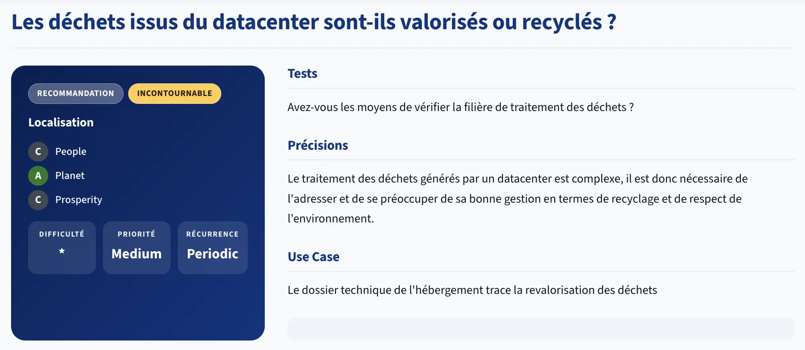

# Hébergement

> **Critères retenus** : 8.3 (PUE), 8.4 (WUE), 8.5 (énergie renouvelable), 8.6 (localisation), 8.8 (données chaudes/froides)

---

## Ce que vous allez constater

Vous avez optimisé le code, les images, les requêtes SQL. Mais une question reste entière : **où tournent ces serveurs, et à quel coût énergétique ?**

L'hébergement est souvent le poste invisible du numérique responsable. Pourtant, un datacenter peut consommer autant qu'une ville moyenne. Choisir un hébergeur, c'est choisir un fournisseur d'énergie - par procuration.

**Letter-flop n'est pas (encore) hébergé** : cette partie est donc volontairement prospective. Elle vous donne les outils pour choisir *quand le moment viendra*.

### 8.3 - PUE : Power Usage Effectiveness

Le **PUE** est le ratio le plus utilisé pour mesurer l'efficacité énergétique d'un datacenter :

```
PUE = Énergie totale consommée par le datacenter
      ─────────────────────────────────────────
      Énergie consommée par les équipements IT
```

- **PUE = 1.0** : idéal théorique - toute l'énergie va aux serveurs, rien n'est perdu en refroidissement, éclairage, alimentation électrique.
- **PUE = 1.2** : excellent - 20 % de surcoût énergétique.
- **PUE = 1.5** : moyen - pour 1 kWh de calcul, 0,5 kWh sont perdus en chaleur/infrastructure.
- **PUE ≥ 2.0** : mauvais - autant d'énergie perdue que consommée pour le calcul.

La moyenne mondiale des datacenters tourne autour de **1.55–1.60** (Uptime Institute 2023). 

> Les hyperscalers atteignent **1.10–1.20** grâce à des refroidissements adiabatiques ou à l'air libre (Finlande, Islande, Suède).

```
PUE 2.0  ████████████████████ 50% pertes
PUE 1.5  ██████████░░░░░░░░░░ 33% pertes
PUE 1.2  ████░░░░░░░░░░░░░░░░ 17% pertes
PUE 1.1  ██░░░░░░░░░░░░░░░░░░  9% pertes
```

> **À retenir** : un PUE de 1.2 vs 1.6 sur 10 000 kWh IT = 4 000 kWh économisés - soit ~1,5 tonne de CO₂ selon le mix électrique.

---

### 8.4 - WUE : Water Usage Effectiveness

Le refroidissement des datacenters consomme de l'eau. Le **WUE** mesure cette consommation :

```
WUE = Litres d'eau consommés par le datacenter
      ─────────────────────────────────────────
      kWh d'énergie IT
```

- **WUE = 0** : refroidissement 100% à l'air libre (possible sous certains climats).
- **WUE < 0.5** : excellent.
- **WUE = 1.0–2.0** : courant dans les datacenters à refroidissement par évaporation.
- **WUE > 2.0** : problématique, surtout en zone de stress hydrique.

Un datacenter traditionnel de 10 MW peut consommer **50 millions de litres d'eau par an** - l'équivalent de 20 piscines olympiques.

> **Attention** : certains datacenters affichent un bon PUE grâce à l'évaporation (tour de refroidissement) mais un mauvais WUE. 
> Les deux métriques sont complémentaires.

---

### 8.5 - Origine de l'électricité

Un serveur alimenté par du charbon émet **800 gCO₂/kWh**. Le même serveur alimenté par de l'hydroélectricité émet **20 gCO₂/kWh**. Le facteur est **40×**.

L'indicateur à regarder : le **PEF (Power Emission Factor)** ou le **CFE (Carbon-Free Energy)** du site d'hébergement.

Deux approches pour les hébergeurs :
1. **Achat direct** d'énergie renouvelable (contrat Power Purchase Agreement ou tarif vert).
2. **RECs / GOs** (*Renewable Energy Certificates* / *Garanties d'Origine*) - l'hébergeur achète des certificats qui attestent qu'une quantité équivalente d'énergie renouvelable a été injectée sur le réseau. **Moins robuste** - l'électricité consommée physiquement peut toujours être d'origine fossile.

> Demandez toujours si c'est une consommation directe ou un certificat. La nuance est énorme.

---

### 8.6 - Localisation géographique

La localisation impacte **deux dimensions** :

**1. L'intensité carbone du mix électrique local**

| Pays/région          | Intensité carbone moyenne | Commentaire                      |
|----------------------|:-------------------------:|----------------------------------|
| Islande              |       ~20 gCO₂/kWh        | Géothermie + hydro               |
| France               |       ~55 gCO₂/kWh        | Parc nucléaire dominant          |
| Suède                |       ~45 gCO₂/kWh        | Hydro + éolien                   |
| Allemagne            |       ~350 gCO₂/kWh       | Mix charbon/gaz encore important |
| Pologne              |       ~700 gCO₂/kWh       | Charbon majoritaire              |
| États-Unis (moyenne) |       ~400 gCO₂/kWh       | Très variable par état           |

**2. La latence réseau**

Un serveur hébergé en Virginie pour des utilisateurs parisiens : ~80–100 ms de latence de base, irrécupérable. Chaque aller-retour réseau paie ce péage.

La bonne pratique : **héberger au plus près des utilisateurs majoritaires**, réduit la latence *et* les émissions de transit réseau.

---

### 8.7 - Traitement de la chaleur

Un datacenter produit de la chaleur. Cette chaleur peut être :
- **Dissipée** (gaspillée via des tours de refroidissement).
- **Réutilisée** (*free-cooling*, chauffage urbain, serres agricoles).

Des initiatives concrètes existent : Microsoft chauffe des bâtiments en Finlande, OVHcloud alimente un réseau de chaleur à Roubaix. C'est un critère différenciant chez les hébergeurs européens.

---

### 8.8 - Données chaudes et froides

Tous les octets ne se valent pas en termes de coût énergétique de stockage :

| Tier             | Accès    | Coût/Go | Usage typique                                  |
|------------------|----------|---------|------------------------------------------------|
| **Chaud** (hot)  | < 1 ms   | Élevé   | Données actives, base de données en production |
| **Tiède** (warm) | secondes | Moyen   | Logs récents, sauvegardes fréquentes           |
| **Froid** (cold) | minutes  | Bas     | Archivage, exports, données > 1 an             |

Pour letter-flop, cette logique s'applique directement aux `movie_logs` :
- **Logs < 6 mois** → base de données active (chaud).
- **Logs 6 mois–2 ans** → stockage objet compressé (froid) : AWS S3 Glacier, OVH Cold Archive, Scaleway Glacier.
- **Logs > 2 ans** → suppression ou export RGPD.

Héberger des téraoctets de logs dans une base PostgreSQL "chaude" coûte 10× plus cher - en argent et en énergie - que dans un stockage froid.

---

### 8.9 - Duplication des données

Chaque copie de donnée a un coût énergétique. Les anti-patterns courants :

- **Réplication sans politique de rétention** : 3 réplicas × croissance infinie = 3× le problème.
- **Sauvegardes sans rotation** : des sauvegardes quotidiennes gardées à vie multiplient le stockage consommé.
- **Cache non expirant** : un Redis/Memcached qui stocke tout indéfiniment.
- **Environments de staging alimentés en prod data** : dupliquer 500 Go de prod en staging pour "être réaliste".

La règle : **autant de copies que nécessaire, pas une de plus**, avec des durées de vie définies pour chacune.

---

### 8.10 - Calculs asynchrones et empreinte temporelle

L'intensité carbone de l'électricité varie dans le temps. En France, le réseau est plus carboné à 9h (pic de demande) et plus propre à 3h du matin (mix hydro/nucléaire de base).

Les frameworks "carbon-aware" exploitent cette variation :
- **Microsoft Carbon Aware SDK** - décale les jobs vers les créneaux bas-carbone.
- **Grid intensity APIs** - electricity maps, WattTime, CO2Signal.
- **Cloud scheduler carbon-aware** - AWS propose des régions avec indicateur carbone en temps réel.

Pour des jobs batch non-urgents (génération de rapports, export de données, retraining de modèles), décaler l'exécution de 4–6 heures peut réduire l'empreinte de 30–50%.

---

## Panorama des hébergeurs

### Hébergeurs français/européens

| Hébergeur        |  PUE déclaré   | Énergie             | Points forts                                | Points de vigilance                   |
|------------------|:--------------:|---------------------|---------------------------------------------|---------------------------------------|
| **OVHcloud**     | 1.09 (Roubaix) | Mix + renouvellable | Chaleur réutilisée, RGPD EU, souveraineté   | Pas 100% renouvelable partout         |
| **Scaleway**     |      1.3       | 100% renouvelable   | DC Paris + Amsterdam, transparence          | Moins de régions que les hyperscalers |
| **Infomaniak**   |      1.08      | 100% hydraulique    | Zéro compensation, suisse, très transparent | Capacité limitée, tarif premium       |
| **Hetzner**      |      1.30      | 100% renouvelable   | Prix compétitifs, allemand/finlandais       | Moins de services managés             |
| **Clever Cloud** |       NC       | NC                  | PaaS français, souveraineté numérique       | Moins d'info sur métriques DC         |

### Hyperscalers

| Provider         | PUE déclaré |    CFE %    | Remarques                                                              |
|------------------|:-----------:|:-----------:|------------------------------------------------------------------------|
| **Google Cloud** |    1.10     | 64% (2023)  | Meilleure transparence, carbon dashboard, objectif 24/7 CFE d'ici 2030 |
| **AWS**          | 1.15 (avg)  | ~85% (2023) | Carbon Footprint Tool, Customer Carbon Footprint disponible            |
| **Azure**        | 1.18 (avg)  | ~82% (2023) | Sustainability Calculator, engagement net-zero 2030                    |
| **Scaleway**     |    1.30     |    100%     | European alternative                                                   |

> **Conseil** : les hyperscalers publient désormais des tableaux de bord carbone par région. Choisir `eu-west-3` (Paris) plutôt que `us-east-1` (Virginie) pour des utilisateurs français divise l'intensité carbone par 5–7.

---

## Application à letter-flop

Letter-flop n'est pas encore hébergé en production. Voici les décisions d'hébergement à prendre en suivant le RGESN :

### Checklist de choix d'hébergeur

```markdown
[ ] PUE < 1.3 (critère 8.3)
[ ] WUE documenté (critère 8.4)
[ ] Énergie renouvelable en consommation directe, pas seulement RECs (critère 8.5)
[ ] Hébergement EU, idéalement France ou voisins (critère 8.6)
[ ] Politique de récupération de chaleur (critère 8.7)
[ ] Offre de stockage froid pour les archives (critère 8.8)
[ ] Politique de rétention des backups documentée (critère 8.9)
[ ] Accès à des APIs d'intensité carbone pour jobs batch (critère 8.10)
```

### Architecture de stockage pour letter-flop

```
movie_logs
    │
    ├── < 6 mois  ──► PostgreSQL (hot)   ← requêtes utilisateur
    ├── 6–24 mois ──► S3/Object Storage (warm, compressé)
    └── > 24 mois ──► Suppression ou export RGPD à la demande
```

> Ce que nous avons modélisé en 7.2 (rétention, politique d'archivage) est exactement le pendant applicatif du critère 8.8 : la stratégie hot/cold commence dans le code, se concrétise dans l'infrastructure.

### Recommandation pour letter-flop

Pour un projet de cette taille (petite application, trafic limité) :

- **Option souveraine** : Scaleway ou Infomaniak - transparence maximale, 100% renouvelable, RGPD natif.
- **Option pragmatique** : OVHcloud `GRA` (Gravelines) - PUE 1.09, infrastructure FR, prix compétitifs.
- **Option hyperscaler** : GCP `europe-west9` (Paris) - meilleur dashboard carbone, facilité d'usage.

Dans tous les cas : **éviter les régions US par défaut** - c'est la décision la plus simple et la plus impactante.

---

## Exercice - Auditer un hébergeur (30 min)

Choisissez l'un des hébergeurs suivants et répondez aux questions ci-dessous :

**Choix** : OVHcloud / Scaleway / Infomaniak / Google Cloud / AWS

### Questions d'audit

1. **PUE** : Quel est le PUE déclaré pour le datacenter le plus proche de vos utilisateurs ? Est-il audité par un tiers ?

2. **Énergie** : L'hébergeur publie-t-il son mix énergétique par datacenter ? Distingue-t-il consommation directe et certificats (RECs/GOs) ?

3. **WUE** : Le WUE est-il publié ? Si non, quel type de refroidissement est utilisé ?

4. **Chaleur** : Existe-t-il un programme de réutilisation de la chaleur fatale ?

5. **Stockage froid** : Propose-t-il une offre de stockage objet avec tiers cold/archive ? À quel prix/Go ?

6. **Rapport de durabilité** : Existe-t-il un rapport annuel avec des métriques vérifiables (pas juste des engagements marketing) ?

### Sources à consulter

- Page "Sustainability" ou "Environnement" de l'hébergeur
- [Uptime Institute Global Data Center Survey](https://uptimeinstitute.com)
- [Electricity Maps](https://www.electricitymaps.com) - intensité carbone en temps réel par pays
- [Green Web Foundation](https://www.thegreenwebfoundation.org) - checker si un domaine est hébergé en vert
- [Cloud Carbon Footprint](https://www.cloudcarbonfootprint.org) - outil open-source d'estimation par provider

---

## Et du côté du GR491 ?
La famille [Hébergement](https://gr491.isit-europe.org/?famille=hebergement).

[](https://gr491.isit-europe.org/crit.php?id=1-hebergement-le-traitement-des-dechets-generes-par-un-f4fc71)

---

## Conclusions

| Critère          | Métrique clé                | Seuil acceptable | Où chercher                    |
|------------------|-----------------------------|------------------|--------------------------------|
| 8.3 PUE          | PUE déclaré                 | < 1.3            | Page datacenter de l'hébergeur |
| 8.4 WUE          | Litres/kWh                  | < 1.0            | Rapport développement durable  |
| 8.5 Énergie      | % renouvelable en direct    | > 80%            | Certificat ou contrat PPA      |
| 8.6 Localisation | Distance utilisateurs       | Même continent   | Console de création d'instance |
| 8.7 Chaleur      | Programme chaleur fatale    | Documenté        | Page RSE                       |
| 8.8 Hot/cold     | Offre stockage froid        | Disponible       | Catalogue tarifaire            |
| 8.9 Duplication  | Politique rétention backups | Documentée       | Console + docs                 |
| 8.10 Async       | API intensité carbone       | Accessible       | Docs API                       |

**Ce que le développeur contrôle directement** :
- Le choix de la région de déploiement (8.6).
- La séparation des données chaudes/froides (8.8) - cf. politique de rétention du chapitre Backend.
- L'ordonnancement des jobs batch vers des créneaux bas-carbone (8.10).

**Ce qui nécessite un choix d'entreprise** :
- La sélection de l'hébergeur (8.3, 8.4, 8.5, 8.7).
- La négociation des SLAs de réplication (8.9).

**La règle des 3 questions** avant de choisir un hébergeur :
- Quel est son PUE ? 
- D'où vient son électricité ? 
- Où sont ses datacenters ?

> Cela couvre 80% des critères d'hébergement du RGESN.
