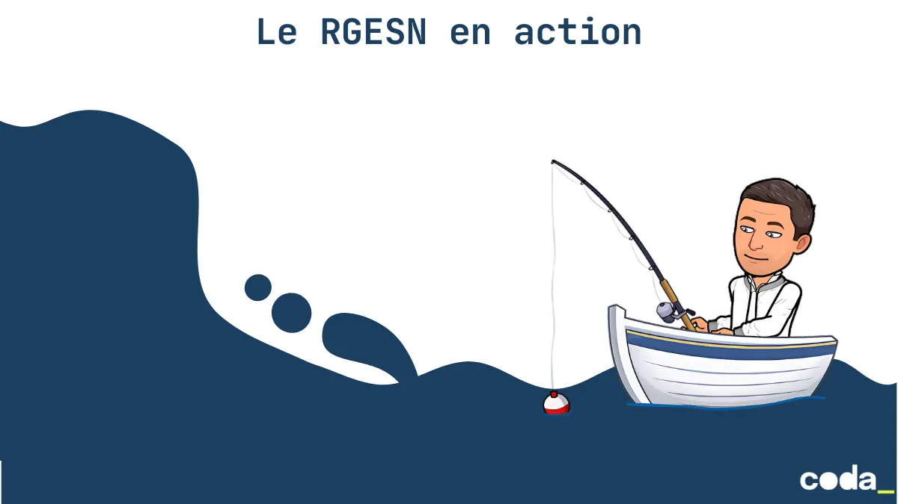

## Objectifs pédagogiques

- Appliquer les principes de l’éco-conception de service numérique pour réduire l’impact environnemental d’un prototype ou d’un service numérique existant
- Utiliser des outils de benchmark (ex :  Lighthouse, Ecoindex, GreenFrame) pour mesurer l’impact d’un service numérique
- Mobiliser les référentiels RGESN et RGAA pour évaluer un service existant, identifier des non-conformités et proposer des pistes d’amélioration
- Structurer un diagnostic d’éco-conception en relevant des leviers concrets d’action sur l’interface, le code ou l’architecture
- exemple : Optimiser les requêtes SQL et les flux de données (filtrage, pagination, indexation) pour limiter les traitements coûteux