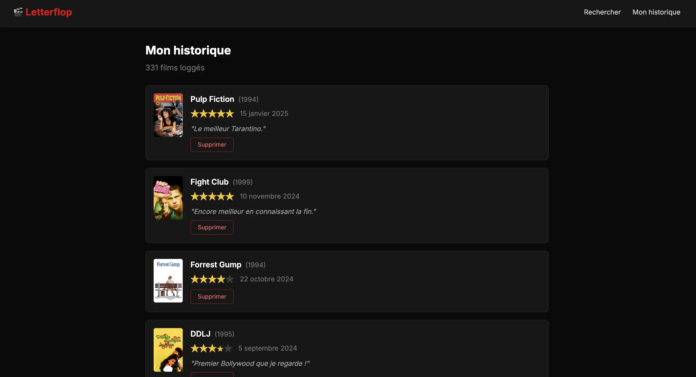

# Letterflop - Le fil rouge du cours



> Le repo de Letterflop est disponible **[ici](https://github.com/ythirion/letter-flop)**

Letter-flop est une application de journal de films : on recherche un film, on consulte sa fiche, on le note et on conserve un historique de ses visionnages.

Elle est **intentionnellement non optimisée** pour servir de terrain d'entraînement tout au long du cours. 

Chaque famille du RGESN que nous aborderons trouvera des violations concrètes à identifier, et des corrections à appliquer dans cette base de code.

---

## Stack technique

| Couche          | Technologie                              |
|-----------------|------------------------------------------|
| Base de données | PostgreSQL 15                            |
| API             | Spring Boot 3.5 (Java 25)                |
| Frontend        | Vanilla TypeScript + Tailwind CSS (Vite) |
| Infra           | Docker / docker-compose                  |

---

## Ce que fait l'application

```
┌──────────────────────────────────────────────────────────┐
│                     Letter-flop                          │
│                                                          │
│  [Recherche]  →  [Fiche film]  →  [Logger / noter]       │
│      ↓                                    ↓              │
│  index.html        movie.html        history.html        │
└──────────────────────────────────────────────────────────┘
        ↕ fetch                      ↕ CRUD
┌──────────────────────────────────────────────────────────┐
│              Spring Boot API (:8080)                     │
│  MovieController          LogController                  │
│       ↕ TMDB API                  ↕ PostgreSQL           │
└──────────────────────────────────────────────────────────┘
```

Trois pages, deux contrôleurs, une base de données. Un service simple - et pourtant suffisant pour y loger **une violation par famille du RGESN**.

---

## Ce qu'on cherche à démontrer

> *Un service simple peut concentrer la quasi-totalité des anti-patterns connus et leur correction est souvent moins coûteuse qu'on ne le croit.*

Letter-flop n'est pas un cas extrême pathologique : c'est un projet qui ressemble à beaucoup de projets réels démarrés sans contrainte d'écoconception. 

La plupart des équipes reconnaîtront des patterns familiers.
